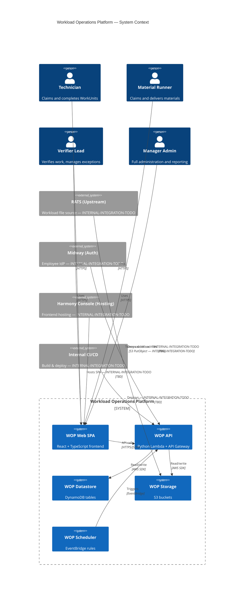
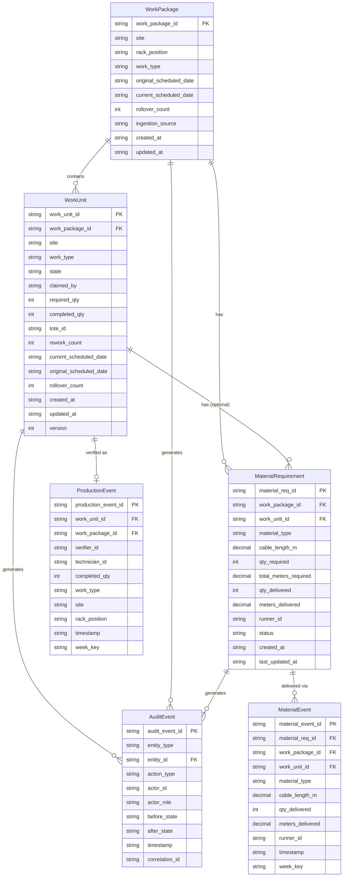
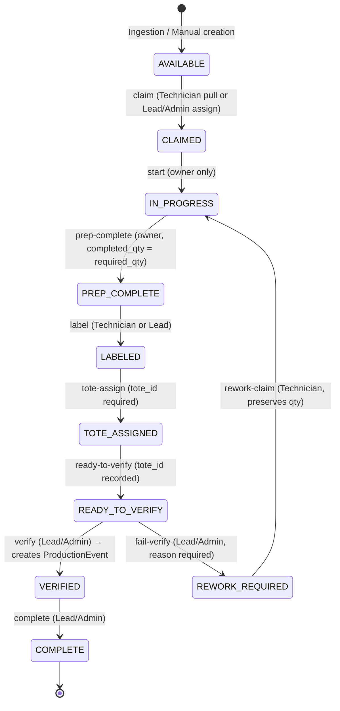
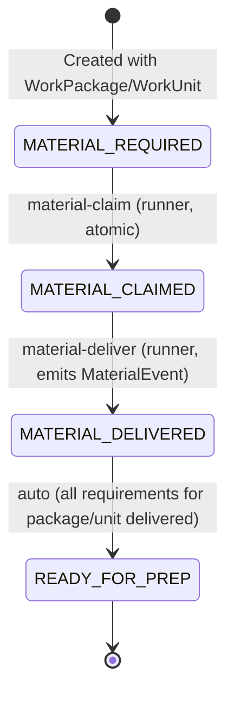

# Design Document — Workload Operations Platform (WOP) V1

**Feature:** workload-operations-platform
**Workflow:** Requirements-First
**Status:** Draft

---

## Table of Contents

1. [Overview](#overview)
2. [Architecture](#architecture)
3. [Components and Interfaces](#components-and-interfaces)
4. [Data Models](#data-models)
5. [DynamoDB Table Design and Access Patterns](#dynamodb-table-design-and-access-patterns)
6. [WorkUnit State Machine](#workunit-state-machine)
7. [Authorization Model](#authorization-model)
8. [API Design](#api-design)
9. [Authentication Module Design](#authentication-module-design)
10. [Idempotency Strategy](#idempotency-strategy)
11. [Concurrency and Atomic Operations](#concurrency-and-atomic-operations)
12. [Audit and Event Model](#audit-and-event-model)
13. [Correctness Properties](#correctness-properties)
14. [Error Handling](#error-handling)
15. [Observability Strategy](#observability-strategy)
16. [Testing Strategy](#testing-strategy)
17. [Deployment and Environment Strategy](#deployment-and-environment-strategy)
18. [Future Extensibility](#future-extensibility)

---

## Overview

The Workload Operations Platform (WOP) is an internal web application that centralises operational workload generated by upstream scheduling and inventory systems. It provides role-based access for four actor types — Technicians, Material Runners, Verifier Leads, and Manager Admins — and covers the full lifecycle from workload ingestion through workflow execution, material delivery tracking, audit logging, production reporting, and automated date rollover.

The key architectural decisions for V1 are: a serverless, event-driven backend built exclusively on AWS managed services (Lambda, API Gateway, DynamoDB, S3, EventBridge); a React + TypeScript SPA frontend; a multi-table DynamoDB design that isolates operational data, audit records, immutable events, and idempotency records into separate tables with independent IAM policies; a replaceable authentication abstraction that uses synthetic tokens in development and is designed to slot in the approved internal IdP (Midway) for production; and a property-based testing strategy using Hypothesis that validates universal invariants across the state machine, quantity bounds, idempotency guarantees, and rollover logic.

All external integrations whose owning team, protocol, or documentation has not been confirmed are tagged **INTERNAL-INTEGRATION-TODO** throughout this document. These tags mark the precise integration points that must be resolved before production deployment.

### System Context

The Workload Operations Platform is an internal web application that centralises operational workload generated by upstream scheduling and inventory systems. It provides role-based access for Technicians, Material Runners, Verifier Leads, and Manager Admins. The boundary of WOP covers ingestion, workflow execution, material delivery tracking, audit logging, production reporting, and automated rollover. All external integrations are tagged **INTERNAL-INTEGRATION-TODO** where the owning team, protocol, or documentation has not been confirmed.

### External Actors

| Actor | Interaction | Notes |
|---|---|---|
| Technician | Claims, starts, updates, and completes WorkUnits through the web SPA | Pull model — self-selects work |
| Material_Runner | Claims and delivers MaterialRequirements | Separate metrics from Technicians (BR-011) |
| Verifier_Lead | Verifies work, initiates rework, performs exception assignment | FR-014, FR-015, FR-007 |
| Manager_Admin | Full read/write, configures system, triggers on-demand reports | FR-019 AC-2 |

### External Systems

| System | Direction | Status | Notes |
|---|---|---|---|
| Upstream workload system (RATS) | Inbound → S3 | **INTERNAL-INTEGRATION-TODO** (DEP-001, DEP-007) | Produces workload files dropped to S3 import prefix; exact file schema unconfirmed (OQ-001) |
| Midway (authentication) | Inbound → Auth module | **INTERNAL-INTEGRATION-TODO** (DEP-002) | Candidate internal IdP; protocol (SAML/OIDC/custom) unconfirmed (OQ-002); SEC-001 requires replaceable auth abstraction |
| Harmony Console (frontend hosting) | Hosting | **INTERNAL-INTEGRATION-TODO** (DEP-006) | Candidate frontend hosting platform (OQ-011); network/DNS integration unconfirmed |
| LB Magic / MICE (inventory) | Not integrated in V1 | **INTERNAL-INTEGRATION-TODO** (DEP-008) | Identified as possible inventory systems; no V1 integration defined |
| Internal CI/CD system | Build/deploy | **INTERNAL-INTEGRATION-TODO** (DEP-005) | Pipeline tooling unconfirmed (OQ-009) |

### System Context Diagram



---

## Architecture

The WOP follows a serverless, event-driven architecture using AWS managed services exclusively (CON-001, CON-002). The frontend is a React SPA; the backend is a set of discrete Python Lambda functions behind Amazon API Gateway; the datastore is DynamoDB; scheduling and rollover are driven by EventBridge; observability is provided by CloudWatch and X-Ray.

### Component Overview

| Component | Technology | Responsibility |
|---|---|---|
| WOP React SPA | React 18, TypeScript, Vite | All user-facing UI: queue, work tracking, material tracking, audit view, reports |
| Amazon API Gateway (REST) | AWS managed | HTTPS termination, request routing, JWT/token-based authorizer stub, throttling |
| wop-auth-handler | Python Lambda | Authentication abstraction — validates token, returns UserContext; synthetic mode in dev/test |
| wop-ingestion-handler | Python Lambda | Processes S3-triggered workload files; creates WorkPackages and WorkUnits |
| wop-workpackage-handler | Python Lambda | CRUD for WorkPackages; returns aggregate state |
| wop-workunit-handler | Python Lambda | All WorkUnit state transitions: claim, start, update-quantity, prep-complete, label, tote-assign, ready-to-verify, verify, fail-verify, complete, assign/reassign |
| wop-material-handler | Python Lambda | MaterialRequirement CRUD; material-claim and material-deliver transitions |
| wop-audit-query-handler | Python Lambda | Read-only query of AuditEvents by entity |
| wop-rollover-handler | Python Lambda | EventBridge-triggered; rolls over AVAILABLE WorkUnits; idempotent per cycle |
| wop-report-handler | Python Lambda | Weekly and on-demand reports derived from ProductionEvents and MaterialEvents |
| wop-idempotency-layer | Lambda Layer (Python) | Shared idempotency logic: check/store IdempotencyRecord; used by all mutating handlers |
| WOP DynamoDB Tables | DynamoDB on-demand | Operational datastore: see the DynamoDB Table Design and Access Patterns section |
| WOP S3 Buckets | S3 | Import prefix (inbound workload files), archive prefix (processed files), error prefix |
| EventBridge Rules | EventBridge | wop-rollover-schedule, wop-report-schedule |
| CloudWatch Log Groups | CloudWatch Logs | Structured JSON logs per Lambda |
| CloudWatch Alarms | CloudWatch | Error rate, p95 latency, claim conflict rate, ingestion failure |
| AWS X-Ray | X-Ray | Distributed tracing across API Gateway and Lambda |

### Component Architecture Diagram

```mermaid
graph TB
    subgraph "Frontend"
        SPA["WOP React SPA\n(React + TypeScript)"]
    end

    subgraph "API Layer"
        APIGW["Amazon API Gateway\n(REST, HTTPS-only)"]
    end

    subgraph "Lambda Functions"
        AUTH["wop-auth-handler\n(Auth abstraction)"]
        INGEST["wop-ingestion-handler\n(S3 trigger)"]
        WPH["wop-workpackage-handler\n(WorkPackage CRUD)"]
        WUH["wop-workunit-handler\n(State transitions)"]
        MAT["wop-material-handler\n(Material workflow)"]
        AUD["wop-audit-query-handler\n(Audit queries)"]
        ROLL["wop-rollover-handler\n(EventBridge trigger)"]
        REP["wop-report-handler\n(Reports)"]
        IDLAYER["wop-idempotency-layer\n(Lambda Layer)"]
    end

    subgraph "Data Layer"
        DDB_MAIN["DynamoDB\nwop-main-table"]
        DDB_AUDIT["DynamoDB\nwop-audit-table"]
        DDB_EVENTS["DynamoDB\nwop-events-table"]
        DDB_IDMP["DynamoDB\nwop-idempotency-table"]
        S3_IMPORT["S3\nwop-import bucket"]
        S3_ARCHIVE["S3\nwop-archive bucket"]
    end

    subgraph "Scheduling"
        EB_ROLLOVER["EventBridge\nwop-rollover-schedule"]
        EB_REPORT["EventBridge\nwop-report-schedule (weekly)"]
    end

    subgraph "Observability"
        CW["CloudWatch Logs\n+ Alarms + Metrics"]
        XRAY["AWS X-Ray\nTracing"]
    end

    SPA -->|HTTPS/JSON| APIGW
    APIGW --> AUTH
    APIGW --> WPH
    APIGW --> WUH
    APIGW --> MAT
    APIGW --> AUD
    APIGW --> REP

    S3_IMPORT -->|S3 event notification| INGEST

    EB_ROLLOVER --> ROLL
    EB_REPORT --> REP

    WUH --> IDLAYER
    MAT --> IDLAYER
    INGEST --> IDLAYER
    WPH --> IDLAYER

    WUH --> DDB_MAIN
    WUH --> DDB_AUDIT
    WUH --> DDB_EVENTS
    WPH --> DDB_MAIN
    WPH --> DDB_AUDIT
    MAT --> DDB_MAIN
    MAT --> DDB_AUDIT
    MAT --> DDB_EVENTS
    INGEST --> DDB_MAIN
    INGEST --> DDB_AUDIT
    INGEST --> S3_ARCHIVE
    ROLL --> DDB_MAIN
    ROLL --> DDB_AUDIT
    ROLL --> DDB_IDMP
    REP --> DDB_EVENTS
    AUD --> DDB_AUDIT
    IDLAYER --> DDB_IDMP

    WUH --> CW
    MAT --> CW
    INGEST --> CW
    ROLL --> CW
    REP --> CW
    APIGW --> XRAY
```



### Lambda Function Responsibilities

#### wop-auth-handler
Implements the AuthProvider interface (see the Authentication Module Design section). In development, validates a synthetic bearer token against a static user registry. In production, the module is replaced with the approved internal IdP integration (**INTERNAL-INTEGRATION-TODO — SEC-001**). Returns a `UserContext` object (user_id, role, display_name) used by all other handlers for attribution and authorization. This handler is invoked as a synchronous internal module import, not as a separate Lambda invocation, to minimize cold-start latency.

#### wop-ingestion-handler
Triggered by S3 ObjectCreated events on the import prefix. Reads the workload file, validates it against the agreed schema (DEP-001), and uses a **two-phase staging/commit approach** to create WorkPackage and WorkUnit records safely:

- **Phase 1 (Staging):** Creates the WorkPackage with `state=INGESTING` and all WorkUnits with `state=STAGING` using TransactWriteItems batches. Staged entities are invisible to the operational queue. If any staging batch fails, the WorkPackage is marked INGESTION_ERROR with an AuditEvent.
- **Phase 2 (Commit):** A final TransactWriteItems transitions the WorkPackage and all WorkUnits from their staging states to AVAILABLE. If the commit fails, the WorkPackage is left in INGESTION_ERROR and the S3 file is moved to the error prefix.

On completion (success or failure), the file is moved to the archive or error prefix respectively. AuditEvents are emitted for staging, commit, and failure. Enforces idempotency using the file S3 key as the idempotency key (FR-001 AC-5). Handles partial-failure rollback so no WorkPackage is left in AVAILABLE after a failed ingestion (FR-001 AC-7).

#### wop-workpackage-handler
Handles `GET /v1/work-packages/{id}` and `POST /v1/work-packages` (Manager_Admin only). Returns WorkPackage with derived aggregate state computed from child WorkUnit states and MaterialRequirement statuses (FR-021 AC-3). Emits one AuditEvent per creation (FR-002 AC-6).

#### wop-workunit-handler
Handles all WorkUnit state transitions. Each operation is implemented as a separate route handler within the same Lambda. Uses DynamoDB conditional writes for all state transitions (NFR-009 AC-1). Enforces ownership rules (only the claiming Technician may advance their own WorkUnit, except for exception assignment by Lead/Admin). Writes state transition and AuditEvent atomically using TransactWriteItems (FR-017 AC-5).

Supported routes:
- `POST /v1/work-units/{id}/claim` — AVAILABLE → CLAIMED
- `POST /v1/work-units/{id}/start` — CLAIMED → IN_PROGRESS
- `PATCH /v1/work-units/{id}/quantity` — update completed_qty while IN_PROGRESS
- `POST /v1/work-units/{id}/prep-complete` — IN_PROGRESS → PREP_COMPLETE
- `POST /v1/work-units/{id}/label` — PREP_COMPLETE → LABELED
- `POST /v1/work-units/{id}/tote-assign` — LABELED → TOTE_ASSIGNED
- `POST /v1/work-units/{id}/ready-to-verify` — TOTE_ASSIGNED → READY_TO_VERIFY
- `POST /v1/work-units/{id}/verify` — READY_TO_VERIFY → VERIFIED (creates ProductionEvent)
- `POST /v1/work-units/{id}/fail-verify` — READY_TO_VERIFY → REWORK_REQUIRED
- `POST /v1/work-units/{id}/complete` — VERIFIED → COMPLETE
- `POST /v1/work-units/{id}/assign` — exception assignment by Lead/Admin

#### wop-material-handler
Handles MaterialRequirement CRUD and the material runner workflow (FR-003, FR-004). Uses DynamoDB conditional writes for material-claim atomicity (OQ-014 resolved: same conditional write pattern as WorkUnit claim). Emits AuditEvents and MaterialEvents on delivery. Validates runner identity from server-side session only (FR-004 AC-9).

#### wop-audit-query-handler
Read-only handler for `GET /v1/audit/{entity_type}/{entity_id}`. Queries the wop-audit-table GSI by entity identifier. Returns events in chronological order (FR-017 AC-3). Accessible to Verifier_Lead and Manager_Admin (FR-017).

#### wop-rollover-handler
Triggered by EventBridge on the configured schedule. Queries for all WorkUnits in AVAILABLE state using the state-site GSI. For each eligible unit, conditionally updates current_scheduled_date and increments rollover_count. Uses a rollover_cycle_key to enforce per-cycle idempotency (FR-022 AC-8). Emits AuditEvents for each rolled-over WorkUnit (FR-022 AC-6). Never touches WorkUnits in any other state (BR-014).

#### wop-report-handler
Invoked by EventBridge weekly schedule or by `POST /v1/reports/weekly` (Manager_Admin). Queries ProductionEvents and MaterialEvents by week_key from wop-events-table. Aggregates counts per Technician and per Material Runner. Returns separate Technician and Material Runner sections — never combined (BR-016, FR-024 AC-3). Results are deterministic given the same underlying immutable events (FR-024 AC-4).

#### wop-idempotency-layer (Lambda Layer)
Shared Python module imported by all mutating handlers. Exposes `check_idempotency(key)` and `store_idempotency_result(key, status_code, response_body)`. Uses DynamoDB PutItem with `attribute_not_exists(pk)` condition to handle concurrent requests with the same key (FR-020 AC-4).

---

## Components and Interfaces

This section maps each Lambda function to its inbound API surface (routes it handles), its outbound DynamoDB table interfaces (tables and operations), and any other AWS service interfaces it uses.

| Lambda Function | API Routes (inbound) | DynamoDB Tables / Operations | Other AWS Interfaces |
|---|---|---|---|
| **wop-auth-handler** | Internal module — no HTTP route; imported by all other handlers at cold start | None — in-memory token validation only (SyntheticAuthProvider) | None (Midway: **INTERNAL-INTEGRATION-TODO**) |
| **wop-ingestion-handler** | S3 ObjectCreated event (no API Gateway route) | wop-main-table: TransactWriteItems (WorkPackage + WorkUnit creation); wop-audit-table: PutItem; wop-idempotency-table: GetItem, PutItem, UpdateItem | S3: GetObject (import prefix), PutObject (archive/error prefix) |
| **wop-workpackage-handler** | `GET /v1/work-packages/{id}`, `GET /v1/work-packages`, `POST /v1/work-packages` | wop-main-table: GetItem, Query (GSI-2), TransactWriteItems; wop-audit-table: PutItem; wop-idempotency-table: GetItem, PutItem, UpdateItem | None |
| **wop-workunit-handler** | `GET /v1/work-units`, `GET /v1/work-units/{id}`, `POST /v1/work-units/{id}/claim`, `POST .../start`, `PATCH .../quantity`, `POST .../prep-complete`, `POST .../label`, `POST .../tote-assign`, `POST .../ready-to-verify`, `POST .../verify`, `POST .../fail-verify`, `POST .../complete`, `POST .../assign`, `GET /v1/work-units/stale` | wop-main-table: GetItem, TransactWriteItems (all state transitions: canonical update + projection update + AuditEvent; verify adds ProductionEvent), Query (GSI-1, GSI-2); wop-audit-table: PutItem (via TransactWriteItems); wop-events-table: PutItem (ProductionEvent on verify, via TransactWriteItems); wop-idempotency-table: GetItem, PutItem, UpdateItem | None |
| **wop-material-handler** | `GET /v1/work-packages/{id}/material-requirements`, `GET /v1/material-requirements`, `POST /v1/work-packages/{id}/material-requirements`, `POST /v1/material-requirements/{id}/material-claim`, `POST /v1/material-requirements/{id}/material-deliver` | wop-main-table: GetItem, TransactWriteItems (all status transitions: canonical update + projection update + AuditEvent; deliver adds MaterialEvent), Query (GSI-2, GSI-3); wop-audit-table: PutItem (via TransactWriteItems); wop-events-table: PutItem (MaterialEvent on deliver, via TransactWriteItems); wop-idempotency-table: GetItem, PutItem, UpdateItem | None |
| **wop-audit-query-handler** | `GET /v1/audit/{entity_type}/{entity_id}` | wop-audit-table: Query (PK by entity) — read-only | None |
| **wop-rollover-handler** | EventBridge scheduled rule (`wop-rollover-schedule`) | wop-main-table: Query (GSI-1, state=AVAILABLE), TransactWriteItems (WorkUnit update + AuditEvent per unit, conditional on state=AVAILABLE); wop-audit-table: PutItem (via TransactWriteItems); wop-idempotency-table: GetItem, PutItem, UpdateItem | EventBridge (trigger source) |
| **wop-report-handler** | `GET /v1/reports/weekly`, `POST /v1/reports/weekly`; also invoked by EventBridge weekly schedule | wop-events-table: Query (GSI-4 production-week-index, GSI-5 material-week-index, GSI-6 technician-week-index, GSI-7 runner-week-index) — read-only | EventBridge (trigger source) |
| **wop-idempotency-layer** | Lambda Layer — no direct API route; imported by all mutating handlers | wop-idempotency-table: GetItem, PutItem (conditional `attribute_not_exists(pk)`), UpdateItem, DeleteItem (orphaned IN_FLIGHT records only) | None |

### Interface Contracts

**AuthProvider interface** (`auth.provider.AuthProvider`) — implemented by `SyntheticAuthProvider` (dev/test) and `MidwayAuthProvider` (prod, **INTERNAL-INTEGRATION-TODO**). Every handler calls `authenticate(event) → UserContext` and the returned `UserContext(user_id, role, display_name)` is the sole identity source for attribution and authorization checks throughout the call. See the Authentication Module Design section for full detail.

**IdempotencyLayer interface** (`idempotency.check_idempotency(key)` / `idempotency.store_idempotency_result(key, status_code, response_body)`) — called by every mutating handler before and after executing business logic. The layer owns the wop-idempotency-table exclusively; no other handler interacts with that table directly.

**Domain state machine interface** (`domain.state_machine.apply_transition(current_state, transition) → TransitionResult`) — pure function with no I/O, called by `wop-workunit-handler`. Returns `is_valid`, `new_state`, and `error_code`. Directly testable as a property-based test target (Property 2 in the Correctness Properties section).

**WorkPackage aggregate state interface** (`domain.compute_work_package_state(work_units, material_requirements) → str`) — pure function called by `wop-workpackage-handler` and `wop-workunit-handler` to derive the WorkPackage state at query time. Never stored as an independent DynamoDB attribute.

---

## Data Models

All entities are designed to support the access patterns in the DynamoDB Table Design section and the event model in the Audit and Event Model section. Attribute names use snake_case. All timestamps are ISO-8601 UTC strings.

### WorkPackage

| Attribute | Type | Notes |
|---|---|---|
| pk | String | `WP#{work_package_id}` |
| sk | String | `METADATA` |
| work_package_id | String | System-generated UUID |
| site | String | Site identifier (e.g., SITE-A) |
| rack_position | String | Rack/position identifier (e.g., RACK-001) |
| work_type | Enum | One of: Fiber, Copper, Metronome, GB200LC, GB300R, GB300AC, Prep Support, Labeling |
| original_scheduled_date | String | ISO date; set at creation, never updated (BR-015) |
| current_scheduled_date | String | ISO date; updated on each rollover |
| rollover_count | Integer | Starts at 0 (FR-002 AC-1) |
| ingestion_source | String | S3 key of the originating file |
| state | Derived | Computed from child WorkUnit and MaterialRequirement states (FR-021 AC-3); not stored as independent mutable field |
| created_at | String | ISO-8601 UTC |
| updated_at | String | ISO-8601 UTC |

> WorkPackage `state` is never stored as an independently mutable DynamoDB attribute. It is computed at query time from the aggregate state of constituent WorkUnits and MaterialRequirements. The derivation rules are specified in the WorkUnit State Machine section.

### WorkUnit

| Attribute | Type | Notes |
|---|---|---|
| pk | String | `WU#{work_unit_id}` |
| sk | String | `METADATA` |
| work_unit_id | String | System-generated UUID |
| work_package_id | String | FK reference to parent WorkPackage |
| site | String | Inherited from parent WorkPackage |
| work_type | Enum | Same enumeration as WorkPackage |
| state | Enum | AVAILABLE, CLAIMED, IN_PROGRESS, PREP_COMPLETE, LABELED, TOTE_ASSIGNED, READY_TO_VERIFY, VERIFIED, COMPLETE, REWORK_REQUIRED |
| claimed_by | String | user_id of claiming Technician; null when AVAILABLE |
| required_qty | Integer | Positive integer (FR-002 AC-3) |
| completed_qty | Integer | Non-negative integer ≤ required_qty; preserved across rework (BR-003, BR-010) |
| tote_id | String | Non-empty string; required before READY_TO_VERIFY (BR-004, FR-012 AC-2) |
| rework_count | Integer | Incremented each time WorkUnit enters REWORK_REQUIRED; starts at 0 |
| current_scheduled_date | String | ISO date; updated on rollover |
| original_scheduled_date | String | ISO date; immutable (BR-015) |
| rollover_count | Integer | Incremented on each rollover; starts at 0 |
| created_at | String | ISO-8601 UTC |
| updated_at | String | ISO-8601 UTC |
| version | Integer | Optimistic lock version; incremented on every write |

> The `version` attribute is used in all conditional writes to detect concurrent modifications alongside the `state` condition.

### MaterialRequirement

| Attribute | Type | Notes |
|---|---|---|
| pk | String | `MR#{material_req_id}` |
| sk | String | `METADATA` |
| material_req_id | String | System-generated UUID |
| work_package_id | String | FK reference to parent WorkPackage |
| work_unit_id | String | FK reference to WorkUnit (nullable if package-level) |
| material_type | Enum | Fiber or Copper (AS-009) |
| cable_length_m | Decimal | Cable length in metres; positive (FR-003 AC-4) |
| qty_required | Integer | Positive integer (FR-003 AC-4) |
| total_meters_required | Decimal | Calculated at creation as cable_length_m × qty_required; immutable (FR-003 AC-3, BR-017) |
| qty_delivered | Integer | Initially 0 (FR-003 AC-2) |
| meters_delivered | Decimal | Initially 0 (FR-003 AC-2) |
| runner_id | String | Authenticated runner identity; initially null (FR-003 AC-2) |
| status | Enum | MATERIAL_REQUIRED, MATERIAL_CLAIMED, MATERIAL_DELIVERED, READY_FOR_PREP |
| created_at | String | ISO-8601 UTC |
| last_updated_at | String | ISO-8601 UTC |

### AuditEvent

| Attribute | Type | Notes |
|---|---|---|
| pk | String | `AUDIT#{entity_type}#{entity_id}` |
| sk | String | `TS#{timestamp}#{uuid}` — composite to ensure uniqueness per millisecond |
| audit_event_id | String | System-generated UUID |
| entity_type | Enum | WORK_PACKAGE, WORK_UNIT, MATERIAL_REQUIREMENT |
| entity_id | String | Identifier of the entity being audited |
| action_type | Enum | See the Audit and Event Model section for full enumeration |
| actor_id | String | Resolved from server-side session (FR-018 AC-1) |
| actor_role | Enum | TECHNICIAN, MATERIAL_RUNNER, VERIFIER_LEAD, MANAGER_ADMIN |
| before_state | String | Entity state before the action (nullable for creation events) |
| after_state | String | Entity state after the action |
| metadata | Map | Action-specific extra data (e.g., failure_reason on REWORK_REQUIRED, previous_qty on quantity update) |
| timestamp | String | ISO-8601 UTC |
| correlation_id | String | Request correlation ID from API Gateway (NFR-004 AC-2) |

> AuditEvents are written to the dedicated wop-audit-table. No application-layer delete operation is defined (SEC-007 AC-1). The Lambda execution roles for operational APIs have PutItem only — no DeleteItem or UpdateItem (SEC-007 AC-3).

### ProductionEvent

| Attribute | Type | Notes |
|---|---|---|
| pk | String | `PE#{production_event_id}` |
| sk | String | `METADATA` |
| production_event_id | String | System-generated UUID |
| work_unit_id | String | FK reference to verified WorkUnit |
| work_package_id | String | FK reference to parent WorkPackage |
| verifier_id | String | Server-verified Verifier_Lead identity (FR-014 AC-2) |
| completed_qty | Integer | Completed quantity at time of verification |
| work_type | Enum | Work type of the WorkUnit |
| site | String | Site identifier |
| rack_position | String | Rack/position identifier |
| timestamp | String | ISO-8601 UTC of verification |
| week_key | String | ISO week string: `YYYY-WNN` (e.g., 2024-W03); used for reporting GSI |
| technician_id | String | Claimed_by identity of the WorkUnit at verification time |

> ProductionEvents are immutable and append-only. Generated only upon successful verification (BR-007, FR-014 AC-2, FR-014 AC-5). No update or delete operations are defined. The week_key is computed server-side as the ISO 8601 week number of the verification timestamp.

### MaterialEvent

| Attribute | Type | Notes |
|---|---|---|
| pk | String | `ME#{material_event_id}` |
| sk | String | `METADATA` |
| material_event_id | String | System-generated UUID |
| material_req_id | String | FK reference to MaterialRequirement |
| work_package_id | String | FK reference to WorkPackage |
| work_unit_id | String | FK reference to WorkUnit (nullable if package-level) |
| material_type | Enum | Fiber or Copper |
| cable_length_m | Decimal | Cable length in metres |
| qty_delivered | Integer | Quantity delivered in this event |
| meters_delivered | Decimal | Metres delivered in this event |
| runner_id | String | Authenticated runner identity (FR-003 AC-8, FR-004 AC-6) |
| timestamp | String | ISO-8601 UTC of delivery |
| week_key | String | ISO week string: `YYYY-WNN` |

> MaterialEvents are the exclusive source for Material Runner metrics (BR-011, FR-024 AC-2). They are separate from ProductionEvents and must never be combined into a shared metric (BR-016).

### IdempotencyRecord

| Attribute | Type | Notes |
|---|---|---|
| pk | String | `IDMP#{idempotency_key}` |
| sk | String | `METADATA` |
| idempotency_key | String | Client-supplied key (FR-020 AC-1) |
| operation | String | Operation name (e.g., claim_work_unit) |
| request_fingerprint | String | SHA-256 hash of `operation + resource_id + canonical_request_body`; used to detect key reuse with different parameters (FR-020 AC-4) |
| resource_id | String | Identifier of the primary resource being mutated (e.g., work_unit_id, material_req_id, s3_object_key); scopes the idempotency key to a specific resource |
| status | Enum | IN_FLIGHT or COMPLETED |
| status_code | Integer | HTTP status code of original response |
| response_body | String | JSON-serialised original response body |
| created_at | String | ISO-8601 UTC |
| ttl | Integer | Unix epoch seconds; minimum now + 86400 (24 h) per FR-020 AC-3 |

### Entity-Relationship Diagram



---

## 4. DynamoDB Table Design and Access Patterns

### Table Strategy: Multi-Table Design

WOP uses a multi-table design rather than a single-table approach. Rationale:

1. **IAM isolation** — AuditEvents require PutItem-only Lambda roles (SEC-007 AC-3). Events and operational records have different access patterns and different IAM requirements that are cleanly separated by table.
2. **TTL and retention** — Retention periods for AuditEvents, ProductionEvents, and MaterialEvents are **INTERNAL-INTEGRATION-TODO** (OQ-007 unresolved). The approved retention requirement must be confirmed by Compliance/Operations before production deployment. Separate tables allow each event type to have an independently configurable TTL policy once the requirement is known.
3. **Throughput isolation** — Report queries over ProductionEvents and MaterialEvents should not consume read capacity from the operational main table, especially during busy operational shifts.
4. **Access pattern clarity** — The operational table has complex multi-dimensional queries. Immutable event tables have simpler, append-heavy access patterns that benefit from independent provisioning.

The four tables are:

| Table | Contents |
|---|---|
| `wop-main-table` | WorkPackages, WorkUnits, MaterialRequirements |
| `wop-audit-table` | AuditEvents |
| `wop-events-table` | ProductionEvents, MaterialEvents |
| `wop-idempotency-table` | IdempotencyRecords |

---

### wop-main-table

**Primary Key:** PK (String, partition) + SK (String, sort)

| Entity | PK | SK |
|---|---|---|
| WorkPackage | `WP#{work_package_id}` | `METADATA` |
| WorkUnit | `WU#{work_unit_id}` | `METADATA` |
| WorkUnit (by WorkPackage) | `WP#{work_package_id}` | `WU#{work_unit_id}` |
| MaterialRequirement | `MR#{material_req_id}` | `METADATA` |
| MaterialRequirement (by WorkPackage) | `WP#{work_package_id}` | `MR#{material_req_id}` |

> Each WorkUnit and MaterialRequirement is stored twice: once with its own PK for direct lookup, and once under the parent WorkPackage PK for list-by-package queries. Both items are written atomically using TransactWriteItems. The denormalized copy under the WorkPackage PK stores a projection of commonly-needed attributes (state, site, work_type, current_scheduled_date) to avoid N+1 reads when listing a package's children.

### Denormalized Projection Strategy

**Selected approach: Atomic dual-write via TransactWriteItems.** Every mutation that changes a WorkUnit or MaterialRequirement MUST include both (a) an Update on the canonical item (`PK=WU#{id}`, SK=METADATA) and (b) an Update on the denormalized projection item (`PK=WP#{work_package_id}`, SK=`WU#{work_unit_id}`) in the same TransactWriteItems call. Both writes succeed or both roll back — there is no eventual consistency gap.

**Projected attributes stored on the denormalized items:**

- **WorkUnit projection** (`PK=WP#{work_package_id}`, SK=`WU#{work_unit_id}`): `{ state, site, work_type, current_scheduled_date, claimed_by, completed_qty, required_qty, tote_id, updated_at }`
- **MaterialRequirement projection** (`PK=WP#{work_package_id}`, SK=`MR#{material_req_id}`): `{ status, material_type, qty_required, qty_delivered, meters_delivered, last_updated_at }`

**Read strategy:**
- List-by-package queries (access patterns 4 and 7) read the projection items directly using GSI-2, with no N+1 fetch of canonical items.
- Full WorkUnit or MaterialRequirement detail (access patterns 1 and 2) reads the canonical item (`PK=WU#{id}` or `PK=MR#{id}`, SK=METADATA).

**Transaction item count per operation:**
- Every state transition has a minimum of **3 items** in the TransactWriteItems call: (1) canonical entity update, (2) denormalized projection update, (3) AuditEvent Put.
- Verification adds a **4th item**: the ProductionEvent Put.
- Material delivery adds a **4th item**: the MaterialEvent Put.
- All remain within DynamoDB's 100-item transact limit given V1 volume assumptions (AS-002).

#### Global Secondary Indexes — wop-main-table

**GSI-1: state-site-worktype-date-index**
- PK: `state` (String)
- SK: `site#work_type#current_scheduled_date` (String, composite)
- Projected attributes: All
- Satisfies: Access patterns 3 (list AVAILABLE queue), 5 (filtered queue by site/work_type/date), 14 (stale active work)
- Rationale: The Technician queue is the highest-frequency read (FR-005). Querying by state first, then filtering by site, work_type, and date is the core access pattern. The composite SK allows range queries such as `begins_with(sk, "SITE-A#Fiber")`.

**GSI-2: work-package-children-index**
- PK: `work_package_id` (String)
- SK: `entity_type#entity_id` (String, composite, e.g., `WU#abc` or `MR#xyz`)
- Projected attributes: All
- Satisfies: Access patterns 4 (list WorkUnits by WorkPackage), 7 (get MaterialRequirements by WorkPackage)
- Rationale: Supports the WorkPackage detail page which shows all child WorkUnits and MaterialRequirements. Using `begins_with(sk, "WU#")` or `begins_with(sk, "MR#")` narrows to the correct entity type.

**GSI-3: material-status-index**
- PK: `status` (String, MaterialRequirement status)
- SK: `work_package_id` (String)
- Projected attributes: All
- Satisfies: Access pattern 8 (list MaterialRequirements by status — Material Runner queue)
- Rationale: Material Runners need to see all requirements in MATERIAL_REQUIRED state. This GSI provides an efficient scan of open material requirements.

---

### wop-audit-table

**Primary Key:** PK (String, partition) + SK (String, sort)

| Entity | PK | SK |
|---|---|---|
| AuditEvent | `AUDIT#{entity_type}#{entity_id}` | `TS#{timestamp}#{uuid}` |

> The composite SK ensures strict chronological ordering (DynamoDB returns SK in lexicographic order; ISO-8601 timestamps sort correctly). The UUID suffix handles sub-millisecond burst events.

#### Global Secondary Indexes — wop-audit-table

None required. The primary key already supports direct query by entity. Chronological order is provided by the SK sort. No cross-entity queries are required in V1.

---

### wop-events-table

**Primary Key:** PK (String, partition) + SK (String, sort)

| Entity | PK | SK |
|---|---|---|
| ProductionEvent | `PE#{production_event_id}` | `METADATA` |
| MaterialEvent | `ME#{material_event_id}` | `METADATA` |

#### Global Secondary Indexes — wop-events-table

**GSI-4: production-week-index**
- PK: `event_type#week_key` (String, e.g., `PE#2024-W03`)
- SK: `timestamp` (String)
- Projected attributes: All
- Satisfies: Access pattern 9 (list ProductionEvents by week_key for reporting)
- Rationale: The weekly report Lambda queries all ProductionEvents for a given ISO week. Composite PK discriminates ProductionEvents from MaterialEvents in the same GSI to avoid cross-type interference.

**GSI-5: material-week-index**
- PK: `event_type#week_key` (String, e.g., `ME#2024-W03`)
- SK: `timestamp` (String)
- Projected attributes: All
- Satisfies: Access pattern 10 (list MaterialEvents by week_key for reporting)
- Note: Could be combined with GSI-4 if the PK prefix discriminates event types, but kept separate for clarity and independent capacity.

**GSI-6: technician-week-index**
- PK: `technician_id` (String)
- SK: `week_key#timestamp` (String, composite)
- Projected attributes: All (ProductionEvents only)
- Satisfies: Access pattern 11 (list ProductionEvents by technician + week_key)
- Rationale: Supports per-Technician production summary in the weekly report (FR-024 AC-1).

**GSI-7: runner-week-index**
- PK: `runner_id` (String)
- SK: `week_key#timestamp` (String, composite)
- Projected attributes: All (MaterialEvents only)
- Satisfies: Access pattern 12 (list MaterialEvents by runner + week_key)
- Rationale: Supports per-Material Runner delivery summary in the weekly report (FR-024 AC-1).

---

### wop-idempotency-table

**Primary Key:** PK (String, partition only — no sort key needed)

| Entity | PK |
|---|---|
| IdempotencyRecord | `IDMP#{idempotency_key}` |

TTL attribute: `ttl` (Number, Unix epoch seconds). DynamoDB TTL removes records after ≥24 hours (FR-020 AC-3). Records are never explicitly deleted by application code.

> **AuditEvent, ProductionEvent, and MaterialEvent DynamoDB item retention: INTERNAL-INTEGRATION-TODO** — the approved retention period (OQ-007) has not been confirmed. DynamoDB TTL on event tables will be configured to the value in SSM Parameter Store `/wop/{env}/event-retention-days`. No TTL is set until the retention requirement is confirmed; items accumulate indefinitely in development. In production, a DynamoDB TTL archival Lambda that moves expiring records to S3 (Glacier tier) is the planned approach but is deferred until OQ-007 is resolved.

---

### Access Pattern Summary

| # | Access Pattern | Table | Key/Index | Operation |
|---|---|---|---|---|
| 1 | Get WorkPackage by ID | wop-main-table | PK=`WP#{id}`, SK=`METADATA` | GetItem |
| 2 | Get WorkUnit by ID | wop-main-table | PK=`WU#{id}`, SK=`METADATA` | GetItem |
| 3 | List WorkUnits in AVAILABLE state (full queue) | wop-main-table | GSI-1: PK=`AVAILABLE` | Query + pagination |
| 4 | List WorkUnits by WorkPackage | wop-main-table | GSI-2: PK=`work_package_id`, SK begins_with `WU#` | Query |
| 5 | List WorkUnits by state + site + work_type + date | wop-main-table | GSI-1: PK=state, SK begins_with `{site}#{work_type}#{date}` | Query + pagination |
| 6 | List AuditEvents by entity (chronological) | wop-audit-table | PK=`AUDIT#{entity_type}#{entity_id}` | Query (ascending SK) |
| 7 | Get MaterialRequirements by WorkPackage | wop-main-table | GSI-2: PK=`work_package_id`, SK begins_with `MR#` | Query |
| 8 | Get MaterialRequirements by status | wop-main-table | GSI-3: PK=`status` | Query |
| 9 | List ProductionEvents by week_key | wop-events-table | GSI-4: PK=`PE#{week_key}` | Query |
| 10 | List MaterialEvents by week_key | wop-events-table | GSI-5: PK=`ME#{week_key}` | Query |
| 11 | List ProductionEvents by technician + week_key | wop-events-table | GSI-6: PK=`technician_id`, SK begins_with `{week_key}` | Query |
| 12 | List MaterialEvents by runner + week_key | wop-events-table | GSI-7: PK=`runner_id`, SK begins_with `{week_key}` | Query |
| 13 | Get IdempotencyRecord by key | wop-idempotency-table | PK=`IDMP#{key}` | GetItem |
| 14 | List stale active WorkUnits | wop-main-table | GSI-1: PK=CLAIMED/IN_PROGRESS/etc., SK < today | Query per non-terminal state |

> Access pattern 14 (stale active work for Lead/Admin review, FR-022 AC-7) requires querying each non-terminal active state (CLAIMED, IN_PROGRESS, PREP_COMPLETE, LABELED, TOTE_ASSIGNED, READY_TO_VERIFY, REWORK_REQUIRED) with a SK filter where `current_scheduled_date < today`. Since DynamoDB does not support inequality filtering on composite SK prefixes across all attribute positions simultaneously, the implementation queries each state separately and merges results in the Lambda. This is acceptable at V1 volumes (AS-002: max 200 concurrent users implies bounded active-work counts).

---

### Pagination

All list operations use DynamoDB's native `LastEvaluatedKey` cursor for pagination. The API returns a maximum of 100 items per page (FR-005 AC-5). The cursor is base64-encoded and returned as a `next_token` in the response. Clients pass `?next_token=` on subsequent requests.

---

### Encryption and PITR

- All tables: server-side encryption with AWS_OWNED_KMS key (SEC-005 AC-1).
- wop-audit-table: Point-in-Time Recovery (PITR) enabled (SEC-007 AC-2).
- wop-events-table: PITR enabled (events are the source of truth for reporting).
- wop-main-table: PITR enabled (operational data).
- wop-idempotency-table: PITR not required (data is transient by design).

---

## 5. WorkUnit State Machine

### Valid Transitions

The following transitions are the complete and exhaustive set of valid WorkUnit state transitions (FR-021 AC-1). Any transition not listed is explicitly rejected by the server with an INVALID_STATE_TRANSITION error.

| From State | To State | Trigger | Actor | Preconditions |
|---|---|---|---|---|
| AVAILABLE | CLAIMED | `POST /claim` | Technician (self-select) or Lead/Admin (assignment) | WorkUnit must exist; conditional write on state=AVAILABLE |
| CLAIMED | IN_PROGRESS | `POST /start` | Technician (owner only) | Actor must be the claimed_by Technician |
| IN_PROGRESS | PREP_COMPLETE | `POST /prep-complete` | Technician (owner only) | completed_qty = required_qty |
| PREP_COMPLETE | LABELED | `POST /label` | Claiming Technician, Verifier_Lead, or Manager_Admin | None beyond state check |
| LABELED | TOTE_ASSIGNED | `POST /tote-assign` | Claiming Technician, Verifier_Lead, or Manager_Admin | tote_id must be a non-empty string (FR-012 AC-2) |
| TOTE_ASSIGNED | READY_TO_VERIFY | `POST /ready-to-verify` | Claiming Technician, Verifier_Lead, or Manager_Admin | tote_id must already be recorded on the WorkUnit (FR-013 AC-2) |
| READY_TO_VERIFY | VERIFIED | `POST /verify` | Verifier_Lead or Manager_Admin | — |
| READY_TO_VERIFY | REWORK_REQUIRED | `POST /fail-verify` | Verifier_Lead or Manager_Admin | failure_reason must be non-empty |
| REWORK_REQUIRED | IN_PROGRESS | `POST /claim` (rework claim) | Technician | WorkUnit in REWORK_REQUIRED; completed_qty and rework history preserved (BR-010) |
| VERIFIED | COMPLETE | `POST /complete` | Verifier_Lead or Manager_Admin | — |

> Exception assignment (FR-007): A Verifier_Lead or Manager_Admin may assign/reassign a WorkUnit in AVAILABLE or CLAIMED state to any Technician via `POST /assign`. For AVAILABLE → CLAIMED, this is a standard claim. For CLAIMED → CLAIMED (reassignment), the before_state is CLAIMED and the AuditEvent records both the previous claimant and new assignee (FR-007 AC-2).

### Actions Triggered on Each Transition

| Transition | AuditEvent | ProductionEvent | Other |
|---|---|---|---|
| AVAILABLE → CLAIMED | Yes — action_type: WORK_UNIT_CLAIMED | No | — |
| CLAIMED → IN_PROGRESS | Yes — action_type: WORK_UNIT_STARTED | No | — |
| IN_PROGRESS → PREP_COMPLETE | Yes — action_type: WORK_UNIT_PREP_COMPLETE | No | — |
| PREP_COMPLETE → LABELED | Yes — action_type: WORK_UNIT_LABELED | No | — |
| LABELED → TOTE_ASSIGNED | Yes — action_type: WORK_UNIT_TOTE_ASSIGNED (includes tote_id in metadata) | No | — |
| TOTE_ASSIGNED → READY_TO_VERIFY | Yes — action_type: WORK_UNIT_READY_TO_VERIFY | No | — |
| READY_TO_VERIFY → VERIFIED | Yes — action_type: WORK_UNIT_VERIFIED | Yes — immutable ProductionEvent created | — |
| READY_TO_VERIFY → REWORK_REQUIRED | Yes — action_type: WORK_UNIT_REWORK_REQUIRED (failure_reason in metadata) | No | rework_count incremented |
| REWORK_REQUIRED → IN_PROGRESS | Yes — action_type: WORK_UNIT_REWORK_CLAIMED | No | completed_qty preserved |
| VERIFIED → COMPLETE | Yes — action_type: WORK_UNIT_COMPLETE | No | WorkUnit excluded from queue |
| quantity update (IN_PROGRESS) | Yes — action_type: WORK_UNIT_QUANTITY_UPDATED (prev/new qty in metadata) | No | — |
| exception assignment | Yes — action_type: WORK_UNIT_ASSIGNED (prev claimant + new assignee in metadata) | No | — |

All AuditEvents and state transitions are written atomically using DynamoDB TransactWriteItems (FR-017 AC-5). For the VERIFIED transition, the TransactWriteItems includes the WorkUnit update + AuditEvent write + ProductionEvent write (three items in a single transaction, within DynamoDB's 100-item transact limit).

### WorkUnit State Machine Diagram



### MaterialRequirement State Machine

| From Status | To Status | Trigger | Actor | Preconditions |
|---|---|---|---|---|
| MATERIAL_REQUIRED | MATERIAL_CLAIMED | `POST /material-requirements/{id}/claim` | Material_Runner | Conditional write on status=MATERIAL_REQUIRED |
| MATERIAL_CLAIMED | MATERIAL_DELIVERED | `POST /material-requirements/{id}/deliver` | Material_Runner (same runner who claimed) | qty_delivered > 0, meters_delivered > 0 |
| MATERIAL_DELIVERED | READY_FOR_PREP | Automatic, triggered by delivery | System | All MaterialRequirements for the WorkPackage/WorkUnit are MATERIAL_DELIVERED (FR-004 AC-5) |



### WorkPackage Aggregate State Derivation Rules

WorkPackage state is not stored as an independent mutable attribute. It is computed at query time from the aggregate of its constituent WorkUnits and MaterialRequirements. The derivation uses a priority-ordered evaluation of child states (FR-021 AC-3). Earlier priorities in the list override later ones.

| Priority | Condition | Derived WorkPackage State |
|---|---|---|
| 1 | Any WorkUnit is in REWORK_REQUIRED | REWORK_REQUIRED |
| 2 | Any WorkUnit is in READY_TO_VERIFY | PENDING_VERIFICATION |
| 3 | Any WorkUnit is in IN_PROGRESS or CLAIMED | IN_PROGRESS |
| 4 | Any MaterialRequirement is in MATERIAL_REQUIRED or MATERIAL_CLAIMED | AWAITING_MATERIAL |
| 5 | Any WorkUnit is in LABELED or TOTE_ASSIGNED or PREP_COMPLETE | PREP_IN_PROGRESS |
| 5a | Some WorkUnits are COMPLETE or VERIFIED and the remainder are AVAILABLE (no active work in progress) | PARTIALLY_COMPLETE |
| 6 | All WorkUnits are in COMPLETE | COMPLETE |
| 7 | All WorkUnits are in VERIFIED | VERIFIED |
| 8 | All WorkUnits are in AVAILABLE | AVAILABLE |
| 9 | WorkPackage has no WorkUnits | IMPORTED |

> These rules are implemented in the `compute_work_package_state(work_units, material_requirements)` function in the domain layer, shared by `wop-workpackage-handler` and `wop-workunit-handler`. The function is pure and has no side effects, making it directly testable. It must handle the PARTIALLY_COMPLETE derived state (Priority 5a). New unit tests must cover each row in the Aggregate State Derivation Examples table below.

### Aggregate State Derivation Examples

These worked examples demonstrate the priority-ordered derivation. Each row shows the exact child states, applies the priority rules in order, and confirms the derived WorkPackage state.

| Child WorkUnit States | MaterialRequirement Statuses | Derived WorkPackage State | Reasoning |
|---|---|---|---|
| All AVAILABLE | None | AVAILABLE | No priority 1–5a applies; Priority 8: all AVAILABLE |
| All COMPLETE | None | COMPLETE | No priority 1–5a applies; Priority 6: all COMPLETE |
| All VERIFIED | None | VERIFIED | No priority 1–5a applies; Priority 7: all VERIFIED |
| [COMPLETE, AVAILABLE] | None | PARTIALLY_COMPLETE | Priority 1–5 do not match; Priority 5a: some COMPLETE, remainder AVAILABLE |
| [VERIFIED, AVAILABLE] | None | PARTIALLY_COMPLETE | Priority 1–5 do not match; Priority 5a: some VERIFIED/COMPLETE, remainder AVAILABLE |
| [COMPLETE, VERIFIED, AVAILABLE] | None | PARTIALLY_COMPLETE | Priority 5a: some terminal (COMPLETE/VERIFIED), rest AVAILABLE |
| [COMPLETE, VERIFIED] | None | VERIFIED | No AVAILABLE remaining; not all COMPLETE. All units at least VERIFIED, so the package is VERIFIED (not COMPLETE, not PARTIALLY_COMPLETE) |
| [IN_PROGRESS, COMPLETE] | None | IN_PROGRESS | Priority 3: any IN_PROGRESS → IN_PROGRESS (beats Priority 5a) |
| [READY_TO_VERIFY, COMPLETE] | None | PENDING_VERIFICATION | Priority 2: any READY_TO_VERIFY |
| [REWORK_REQUIRED, COMPLETE] | None | REWORK_REQUIRED | Priority 1: any REWORK_REQUIRED |
| [PREP_COMPLETE, AVAILABLE] | None | PREP_IN_PROGRESS | Priority 5: any PREP_COMPLETE |
| [AVAILABLE, AVAILABLE] | [MATERIAL_REQUIRED] | AWAITING_MATERIAL | Priority 4: any open material requirement |
| [AVAILABLE, AVAILABLE] | [MATERIAL_DELIVERED, READY_FOR_PREP] | AVAILABLE | All materials delivered; Priority 8: all WorkUnits AVAILABLE |
| [IN_PROGRESS, AVAILABLE] | [MATERIAL_CLAIMED] | IN_PROGRESS | Priority 3 (IN_PROGRESS) beats Priority 4 (open material) |
| [PREP_COMPLETE, AVAILABLE] | [MATERIAL_CLAIMED] | PREP_IN_PROGRESS | Priority 5 (PREP_COMPLETE) beats Priority 4 only if no IN_PROGRESS/CLAIMED; but Priority 4 applies first? No — Priority 4 > Priority 5 in ordering. Correct result: AWAITING_MATERIAL (Priority 4 beats Priority 5). |
| No WorkUnits | None | IMPORTED | Priority 9: no WorkUnits |

> **Note on Priority 4 vs Priority 5:** Priority 4 (AWAITING_MATERIAL) is evaluated before Priority 5 (PREP_IN_PROGRESS). A WorkPackage with any open MaterialRequirement is in AWAITING_MATERIAL even if some WorkUnits are in PREP_COMPLETE — material must arrive before prep work is meaningful. If both conditions are present, AWAITING_MATERIAL is returned.

---

## 6. Authorization Model

### Role Definitions

Four roles are defined (FR-019 AC-2). Roles are resolved from server-side session context (SEC-002 AC-1). The server never trusts a role claim in the request body or headers (FR-019 AC-4, SEC-001).

| Role | Symbol |
|---|---|
| Technician | TECH |
| Material_Runner | RUNNER |
| Verifier_Lead | LEAD |
| Manager_Admin | ADMIN |

### RBAC Matrix

| Operation | TECH | RUNNER | LEAD | ADMIN | Ownership Rule |
|---|---|---|---|---|---|
| View workload queue (GET /v1/work-units) | ✓ | ✓ | ✓ | ✓ | None — read-only |
| Get WorkUnit by ID | ✓ | ✓ | ✓ | ✓ | None — read-only |
| Get WorkPackage by ID | ✓ | ✓ | ✓ | ✓ | None — read-only |
| Create WorkPackage (POST /v1/work-packages) | — | — | — | ✓ | Admin only |
| Claim WorkUnit (POST /claim) | ✓ | — | ✓ | ✓ | Technician self-selects; Lead/Admin may assign |
| Start WorkUnit (POST /start) | ✓ | — | — | — | Only the claiming Technician (claimed_by == actor_id) |
| Update quantity (PATCH /quantity) | ✓ | — | — | — | Only the claiming Technician |
| Prep complete (POST /prep-complete) | ✓ | — | — | — | Only the claiming Technician |
| Label (POST /label) | ✓ | — | ✓ | ✓ | Technician must be the claiming Technician (claimed_by == actor_id). Verifier_Lead and Manager_Admin may label any WorkUnit in PREP_COMPLETE regardless of who claimed it. |
| Tote assign (POST /tote-assign) | ✓ | — | ✓ | ✓ | Technician must be the claiming Technician (claimed_by == actor_id). Verifier_Lead and Manager_Admin may assign a tote to any WorkUnit in LABELED regardless of who claimed it. |
| Ready to verify (POST /ready-to-verify) | ✓ | — | ✓ | ✓ | Technician must be the claiming Technician (claimed_by == actor_id). Verifier_Lead and Manager_Admin may submit any WorkUnit in TOTE_ASSIGNED regardless of who claimed it. |
| Verify (POST /verify) | — | — | ✓ | ✓ | LEAD or ADMIN only; no ownership check required (FR-014 AC-4, FR-015 AC-5) |
| Fail-verify / initiate rework (POST /fail-verify) | — | — | ✓ | ✓ | LEAD or ADMIN only; no ownership check required (FR-014 AC-4, FR-015 AC-5) |
| Complete (POST /complete) | — | — | ✓ | ✓ | Any authorized role |
| Exception assign/reassign (POST /assign) | — | — | ✓ | ✓ | Lead/Admin only |
| Rework claim (POST /claim on REWORK_REQUIRED) | ✓ | — | — | — | Technician only (FR-015 AC-5) |
| View MaterialRequirements | ✓ | ✓ | ✓ | ✓ | Any authenticated user (FR-003 AC-5) |
| Material claim (POST /material-claim) | — | ✓ | — | ✓ | Runner identity from session (FR-004 AC-10) |
| Material deliver (POST /material-deliver) | — | ✓ | — | ✓ | Runner identity from session |
| View audit history | — | — | ✓ | ✓ | FR-017 |
| Trigger on-demand report | — | — | — | ✓ | FR-024 AC-5 |
| View weekly report | — | — | ✓ | ✓ | FR-024 AC-1 |
| Ingest workload (trigger S3 ingestion) | — | — | — | ✓ | FR-001 |
| View stale active work | — | — | ✓ | ✓ | FR-022 AC-7 |

### Ownership Rules

Ownership is enforced in the Lambda handler **after** role checks pass:

1. **Start, Update Quantity, Prep Complete**: `actor_id == work_unit.claimed_by`. If the actor is not the claiming Technician, return HTTP 403 with AUTHORIZATION_DENIED. (FR-008 AC-2, FR-009, FR-010 AC-3)
2. **Material Deliver**: `actor_id == material_req.runner_id` (the runner who claimed must be the same runner who delivers). (FR-004 AC-4 implies this — the runner's server-verified identity is recorded at claim time and must match at delivery time.)
3. **Exception Assignment**: No ownership check — Lead/Admin may target any WorkUnit in AVAILABLE or CLAIMED state (FR-007 AC-1).
4. **Label, Tote Assign, Ready-to-Verify**: For Technician actors, `actor_id == work_unit.claimed_by` is required. If a Technician submits these operations for a WorkUnit they did not claim, return HTTP 403 AUTHORIZATION_DENIED. Verifier_Lead and Manager_Admin bypass this ownership check and may perform these operations on any WorkUnit in the correct preceding state, regardless of who claimed it. (FR-011, FR-012, FR-013)

### Authorization Enforcement Pattern

All Lambda handlers import the `auth_middleware` module, which is the first call in every handler:

```python
def handler(event, context):
    user_ctx = auth_middleware.authenticate(event)        # raises AuthError → HTTP 401 if missing
    auth_middleware.authorize(user_ctx, required_roles)   # raises AuthzError → HTTP 403 if insufficient role
    # ... business logic with ownership checks inline ...
```

Authorization is enforced in Lambda function code, not solely in API Gateway authorizers (SEC-002 AC-1). API Gateway may perform token presence checks, but the Lambda always independently validates role and ownership.

Error responses for authorization failures include no information about the target resource (SEC-002 AC-3):

```json
{
  "error": {
    "code": "AUTHORIZATION_DENIED",
    "message": "You do not have permission to perform this action.",
    "request_id": "abc-123",
    "timestamp": "2024-01-01T00:00:00Z"
  }
}
```

---

## 7. API Design

All endpoints are prefixed with `/v1/` per versioning requirement (NFR-010 AC-2). All requests and responses use `Content-Type: application/json`. All endpoints require HTTPS (SEC-004 AC-1). The `Idempotency-Key` header is accepted on all mutating (POST, PATCH, PUT) endpoints (FR-020 AC-1).

Standard response headers on all responses:
- `X-Request-Id: {correlation_id}` — for log tracing (NFR-004 AC-2)
- `X-Api-Version: 1.0`

---

### WorkPackage Endpoints

#### GET /v1/work-packages/{work_package_id}

Returns a WorkPackage with its derived aggregate state and a list of child WorkUnit summaries and MaterialRequirement summaries.

- **Required roles:** TECH, RUNNER, LEAD, ADMIN
- **Response 200:**
```json
{
  "work_package_id": "wp-uuid",
  "site": "SITE-A",
  "rack_position": "RACK-001",
  "work_type": "Fiber",
  "original_scheduled_date": "2024-01-15",
  "current_scheduled_date": "2024-01-15",
  "rollover_count": 0,
  "derived_state": "IN_PROGRESS",
  "created_at": "2024-01-14T10:00:00Z",
  "updated_at": "2024-01-14T10:00:00Z",
  "work_units": [ { "work_unit_id": "...", "state": "IN_PROGRESS", "claimed_by": "TECH-001" } ],
  "material_requirements": [ { "material_req_id": "...", "status": "MATERIAL_REQUIRED" } ]
}
```
- **Response 404:** RESOURCE_NOT_FOUND

#### GET /v1/work-packages

Lists WorkPackages. Supports query parameters: `site`, `work_type`, `current_scheduled_date`, `next_token` (pagination cursor).

- **Required roles:** TECH, RUNNER, LEAD, ADMIN
- **Response 200:**
```json
{
  "items": [ { "work_package_id": "...", "site": "...", "derived_state": "..." } ],
  "next_token": "base64cursor",
  "count": 25
}
```

#### POST /v1/work-packages

Creates a new WorkPackage (and optionally its WorkUnits) manually. Used by Manager_Admin outside the ingestion flow.

- **Required roles:** ADMIN
- **Idempotency-Key:** Required
- **Request body:**
```json
{
  "site": "SITE-A",
  "rack_position": "RACK-001",
  "work_type": "Fiber",
  "scheduled_date": "2024-01-15",
  "work_units": [
    { "required_qty": 10, "work_type": "Fiber" }
  ]
}
```
- **Response 201:** Created WorkPackage object
- **Response 400:** VALIDATION_ERROR (missing mandatory attribute — FR-002 AC-4)
- **Response 409:** IDEMPOTENCY_CONFLICT (if idempotency key already used with different payload)

---

### WorkUnit Endpoints

#### GET /v1/work-units

Lists WorkUnits. Primary queue endpoint for Technicians.

- **Required roles:** TECH, RUNNER, LEAD, ADMIN
- **Query parameters:** `state` (default: AVAILABLE), `site`, `work_type`, `current_scheduled_date`, `next_token`
- **Response 200:**
```json
{
  "items": [
    {
      "work_unit_id": "wu-uuid",
      "work_package_id": "wp-uuid",
      "site": "SITE-A",
      "rack_position": "RACK-001",
      "current_scheduled_date": "2024-01-15",
      "original_scheduled_date": "2024-01-14",
      "rollover_count": 1,
      "work_type": "Fiber",
      "state": "AVAILABLE",
      "required_qty": 10,
      "completed_qty": 0
    }
  ],
  "next_token": "base64cursor",
  "count": 50
}
```
Results within 3 seconds at 95th percentile under 50 concurrent users (NFR-001 AC-1).

#### GET /v1/work-units/{work_unit_id}

Returns full WorkUnit detail.

- **Required roles:** TECH, RUNNER, LEAD, ADMIN
- **Response 200:** Full WorkUnit object including tote_id, rework_count, claimed_by
- **Response 404:** RESOURCE_NOT_FOUND

#### POST /v1/work-units/{work_unit_id}/claim

Atomically claims a WorkUnit. Technician pull model (BR-013).

- **Required roles:** TECH, LEAD, ADMIN
- **Idempotency-Key:** Accepted
- **Request body:** `{}` (empty; actor_id resolved from session)
- **Response 200:**
```json
{
  "work_unit_id": "wu-uuid",
  "state": "CLAIMED",
  "claimed_by": "TECH-001",
  "claimed_at": "2024-01-15T08:00:00Z"
}
```
- **Response 409:** CLAIM_CONFLICT (WorkUnit already claimed by another actor)
- **Response 400:** INVALID_STATE_TRANSITION (not in AVAILABLE or REWORK_REQUIRED state)

#### POST /v1/work-units/{work_unit_id}/start

Transitions CLAIMED → IN_PROGRESS.

- **Required roles:** TECH (owner only)
- **Idempotency-Key:** Accepted
- **Request body:** `{}`
- **Response 200:** Updated WorkUnit object
- **Response 403:** AUTHORIZATION_DENIED (not the owner)
- **Response 400:** INVALID_STATE_TRANSITION

#### PATCH /v1/work-units/{work_unit_id}/quantity

Updates completed_qty while IN_PROGRESS.

- **Required roles:** TECH (owner only)
- **Idempotency-Key:** Accepted
- **Request body:**
```json
{ "completed_qty": 7 }
```
- **Response 200:** Updated WorkUnit with new completed_qty
- **Response 400:** QUANTITY_EXCEEDED (new qty > required_qty), INVALID_STATE_TRANSITION (not IN_PROGRESS)
- **Response 403:** AUTHORIZATION_DENIED

#### POST /v1/work-units/{work_unit_id}/prep-complete

Transitions IN_PROGRESS → PREP_COMPLETE. Requires completed_qty = required_qty.

- **Required roles:** TECH (owner only)
- **Idempotency-Key:** Accepted
- **Request body:** `{}`
- **Response 200:** Updated WorkUnit
- **Response 400:** VALIDATION_ERROR (completed_qty < required_qty — FR-010 AC-2), INVALID_STATE_TRANSITION

#### POST /v1/work-units/{work_unit_id}/label

Transitions PREP_COMPLETE → LABELED.

- **Required roles:** TECH, LEAD, ADMIN
- **Idempotency-Key:** Accepted
- **Request body:** `{}`
- **Response 200:** Updated WorkUnit
- **Response 400:** INVALID_STATE_TRANSITION

#### POST /v1/work-units/{work_unit_id}/tote-assign

Transitions LABELED → TOTE_ASSIGNED.

- **Required roles:** TECH, LEAD, ADMIN
- **Idempotency-Key:** Accepted
- **Request body:**
```json
{ "tote_id": "TOTE-9921" }
```
- **Response 200:** Updated WorkUnit with tote_id
- **Response 400:** TOTE_REQUIRED (tote_id is empty string), INVALID_STATE_TRANSITION

#### POST /v1/work-units/{work_unit_id}/ready-to-verify

Transitions TOTE_ASSIGNED → READY_TO_VERIFY. Validates tote_id is recorded.

- **Required roles:** TECH, LEAD, ADMIN
- **Idempotency-Key:** Accepted
- **Request body:** `{}`
- **Response 200:** Updated WorkUnit
- **Response 400:** TOTE_REQUIRED (tote_id missing — FR-013 AC-2), INVALID_STATE_TRANSITION

#### POST /v1/work-units/{work_unit_id}/verify

Transitions READY_TO_VERIFY → VERIFIED. Creates ProductionEvent.

- **Required roles:** LEAD, ADMIN
- **Idempotency-Key:** Required (to prevent duplicate ProductionEvents — FR-020 AC-5)
- **Request body:** `{}`
- **Response 200:** Updated WorkUnit + ProductionEvent summary
- **Response 400:** INVALID_STATE_TRANSITION
- **Response 403:** AUTHORIZATION_DENIED

#### POST /v1/work-units/{work_unit_id}/fail-verify

Transitions READY_TO_VERIFY → REWORK_REQUIRED.

- **Required roles:** LEAD, ADMIN
- **Idempotency-Key:** Accepted
- **Request body:**
```json
{ "failure_reason": "Incorrect cable routing on rack A3" }
```
- **Response 200:** Updated WorkUnit with rework_count incremented
- **Response 400:** VALIDATION_ERROR (failure_reason empty), INVALID_STATE_TRANSITION

#### POST /v1/work-units/{work_unit_id}/complete

Transitions VERIFIED → COMPLETE.

- **Required roles:** LEAD, ADMIN
- **Idempotency-Key:** Accepted
- **Request body:** `{}`
- **Response 200:** Updated WorkUnit
- **Response 400:** INVALID_STATE_TRANSITION

#### POST /v1/work-units/{work_unit_id}/assign

Exception assignment or reassignment of a WorkUnit to a specific Technician. Targets AVAILABLE or CLAIMED WorkUnits (FR-007).

- **Required roles:** LEAD, ADMIN
- **Idempotency-Key:** Accepted
- **Request body:**
```json
{ "technician_id": "TECH-005" }
```
- **Response 200:** Updated WorkUnit with new claimed_by
- **Response 403:** AUTHORIZATION_DENIED
- **Response 400:** INVALID_STATE_TRANSITION (not AVAILABLE or CLAIMED)

---

### MaterialRequirement Endpoints

#### GET /v1/work-packages/{work_package_id}/material-requirements

Lists all MaterialRequirements for a WorkPackage.

- **Required roles:** TECH, RUNNER, LEAD, ADMIN
- **Response 200:**
```json
{
  "items": [
    {
      "material_req_id": "mr-uuid",
      "material_type": "Fiber",
      "cable_length_m": 50.0,
      "qty_required": 4,
      "total_meters_required": 200.0,
      "qty_delivered": 0,
      "status": "MATERIAL_REQUIRED"
    }
  ]
}
```

#### GET /v1/material-requirements

Lists MaterialRequirements by status. Primary queue for Material Runners.

- **Required roles:** TECH, RUNNER, LEAD, ADMIN
- **Query parameters:** `status` (default: MATERIAL_REQUIRED), `next_token`
- **Response 200:** Paginated list of MaterialRequirements

#### POST /v1/work-packages/{work_package_id}/material-requirements

Creates a MaterialRequirement against a WorkPackage or WorkUnit.

- **Required roles:** ADMIN
- **Idempotency-Key:** Accepted
- **Request body:**
```json
{
  "material_type": "Fiber",
  "cable_length_m": 50.0,
  "qty_required": 4,
  "work_unit_id": "wu-uuid"
}
```
- **Response 201:** Created MaterialRequirement (total_meters_required computed server-side)
- **Response 400:** VALIDATION_ERROR (non-positive qty or cable_length — FR-003 AC-4)

---

### Material Runner Workflow Endpoints

#### POST /v1/material-requirements/{material_req_id}/material-claim

Atomically claims a MaterialRequirement for a Material Runner.

- **Required roles:** RUNNER, ADMIN
- **Idempotency-Key:** Accepted
- **Request body:** `{}` (runner_id resolved from session — FR-004 AC-9)
- **Response 200:** Updated MaterialRequirement with status=MATERIAL_CLAIMED
- **Response 409:** MATERIAL_CLAIM_CONFLICT (already claimed)
- **Response 400:** INVALID_STATE_TRANSITION (not in MATERIAL_REQUIRED)
- **Response 403:** AUTHORIZATION_DENIED (FR-004 AC-10)

#### POST /v1/material-requirements/{material_req_id}/material-deliver

Records delivery and transitions to MATERIAL_DELIVERED. Automatically evaluates READY_FOR_PREP transition.

- **Required roles:** RUNNER, ADMIN
- **Idempotency-Key:** Required (prevents duplicate MaterialEvents — FR-020 AC-6)
- **Request body:**
```json
{
  "qty_delivered": 4,
  "meters_delivered": 200.0
}
```
- **Response 200:** Updated MaterialRequirement + MaterialEvent summary
- **Response 400:** INVALID_STATE_TRANSITION (not in MATERIAL_CLAIMED), VALIDATION_ERROR
- **Response 403:** AUTHORIZATION_DENIED

---

### Audit Endpoints

#### GET /v1/audit/{entity_type}/{entity_id}

Returns all AuditEvents for a WorkUnit or WorkPackage in chronological order.

- **Required roles:** LEAD, ADMIN
- **Path parameters:** `entity_type` = `work-unit` or `work-package`, `entity_id` = the entity UUID
- **Query parameters:** `next_token` (pagination)
- **Response 200:**
```json
{
  "items": [
    {
      "audit_event_id": "ae-uuid",
      "entity_type": "WORK_UNIT",
      "entity_id": "wu-uuid",
      "action_type": "WORK_UNIT_CLAIMED",
      "actor_id": "TECH-001",
      "actor_role": "TECHNICIAN",
      "before_state": "AVAILABLE",
      "after_state": "CLAIMED",
      "metadata": {},
      "timestamp": "2024-01-15T08:00:00Z",
      "correlation_id": "req-abc"
    }
  ],
  "next_token": null,
  "count": 14
}
```

---

### Report Endpoints

#### GET /v1/reports/weekly

Returns the weekly production summary for a given ISO week.

- **Required roles:** LEAD, ADMIN
- **Query parameters:** `week_key` (e.g., `2024-W03`, required)
- **Response 200:**
```json
{
  "week_key": "2024-W03",
  "generated_at": "2024-01-22T06:00:00Z",
  "technician_production": [
    {
      "technician_id": "TECH-001",
      "verified_units_by_work_type": { "Fiber": 12, "Copper": 4 },
      "total_verified_qty": 48
    }
  ],
  "material_runner_deliveries": [
    {
      "runner_id": "RUNNER-001",
      "material_runs_completed": 8,
      "total_meters_delivered": 1600.0,
      "work_packages_supplied": 5
    }
  ]
}
```
- **Note:** Technician and Material Runner sections are always separate (BR-016). No combined productivity metric is returned.

#### POST /v1/reports/weekly

Triggers on-demand weekly report generation for a specific week.

- **Required roles:** ADMIN
- **Request body:** `{ "week_key": "2024-W03" }`
- **Response 200:** Same shape as GET /v1/reports/weekly

---

### Admin / Utility Endpoints

#### GET /v1/work-units/stale

Returns WorkUnits in active states (CLAIMED, IN_PROGRESS, PREP_COMPLETE, LABELED, TOTE_ASSIGNED, READY_TO_VERIFY, REWORK_REQUIRED) where current_scheduled_date is in the past. Lead/Admin review view.

- **Required roles:** LEAD, ADMIN
- **Query parameters:** `next_token`
- **Response 200:** Paginated list of stale WorkUnits with their current state and scheduled dates (FR-022 AC-7)

#### GET /v1/health

Health check endpoint. No authentication required.

- **Response 200:** `{ "status": "ok", "version": "1.0" }`

---

## 8. Authentication Module Design

The authentication module implements a single replaceable abstraction layer (SEC-001 AC-1). Business logic in every Lambda handler calls only the `AuthProvider` interface. The concrete implementation is swapped via dependency injection at Lambda initialisation time, controlled by the `AUTH_MODE` environment variable.

### AuthProvider Interface

```python
from dataclasses import dataclass
from typing import Protocol

@dataclass
class UserContext:
    user_id: str          # Unique identifier (e.g., "TECH-001" in dev, employee ID in prod)
    role: str             # One of: TECHNICIAN, MATERIAL_RUNNER, VERIFIER_LEAD, MANAGER_ADMIN
    display_name: str     # Human-readable name for AuditEvent display

class AuthProvider(Protocol):
    def authenticate(self, request_event: dict) -> UserContext:
        """
        Extracts and validates the bearer token from the Authorization header.
        Returns a UserContext on success.
        Raises AuthenticationError (→ HTTP 401) if the token is absent or invalid.
        """
        ...

    def validate_token(self, token: str) -> UserContext:
        """
        Validates a raw token string and returns the UserContext it encodes.
        Called internally by authenticate().
        """
        ...

    def get_synthetic_user(self, user_id: str) -> UserContext:
        """
        Development/test only. Returns a UserContext for a known synthetic user_id.
        Raises AuthenticationError if user_id is not in the synthetic registry.
        """
        ...
```

### Development / Test: SyntheticAuthProvider

Active when `AUTH_MODE=synthetic`. Maintains a static in-memory mapping of bearer tokens to synthetic user identities. No external calls are made. This allows full end-to-end testing without a real identity provider (SEC-001 AC-2, CON-003).

```python
SYNTHETIC_USERS = {
    "token-tech-001":   UserContext("TECH-001",   "TECHNICIAN",     "Technician One"),
    "token-tech-002":   UserContext("TECH-002",   "TECHNICIAN",     "Technician Two"),
    "token-runner-001": UserContext("RUNNER-001", "MATERIAL_RUNNER","Runner One"),
    "token-verify-001": UserContext("VERIFY-001", "VERIFIER_LEAD",  "Lead One"),
    "token-admin-001":  UserContext("ADMIN-001",  "MANAGER_ADMIN",  "Admin One"),
}

class SyntheticAuthProvider:
    def authenticate(self, request_event: dict) -> UserContext:
        auth_header = request_event.get("headers", {}).get("Authorization", "")
        token = auth_header.removeprefix("Bearer ").strip()
        if not token:
            raise AuthenticationError("Missing Authorization header")
        return self.validate_token(token)

    def validate_token(self, token: str) -> UserContext:
        user = SYNTHETIC_USERS.get(token)
        if not user:
            raise AuthenticationError(f"Unknown synthetic token: {token}")
        return user

    def get_synthetic_user(self, user_id: str) -> UserContext:
        for ctx in SYNTHETIC_USERS.values():
            if ctx.user_id == user_id:
                return ctx
        raise AuthenticationError(f"Synthetic user not found: {user_id}")
```

### Production: MidwayAuthProvider — INTERNAL-INTEGRATION-TODO

Active when `AUTH_MODE=midway` (SEC-001 AC-4). The `MidwayAuthProvider` class implements the same `AuthProvider` interface. It replaces `SyntheticAuthProvider` without any changes to business logic.

**Information required before implementation can begin (DEP-002, OQ-002):**
- Authentication protocol: SAML 2.0, OpenID Connect, or custom Midway token format
- Token endpoint or JWKS URI for token validation
- Claim names for employee ID, display name, and role in the token payload
- Token lifetime and refresh policy
- Network path from Lambda VPC (if any) to the Midway endpoint
- Integration approval from the identity team

**Placeholder implementation:**

```python
class MidwayAuthProvider:
    """
    INTERNAL-INTEGRATION-TODO: Replace this stub with the actual Midway integration.
    Required information: see DEP-002 and OQ-002 in requirements.md.
    """
    def authenticate(self, request_event: dict) -> UserContext:
        raise NotImplementedError(
            "INTERNAL-INTEGRATION-TODO: Midway authentication not yet implemented. "
            "See DEP-002 for integration requirements."
        )

    def validate_token(self, token: str) -> UserContext:
        raise NotImplementedError("INTERNAL-INTEGRATION-TODO: Midway token validation")

    def get_synthetic_user(self, user_id: str) -> UserContext:
        raise NotImplementedError("Synthetic users are not available in production auth mode")
```

### Lambda Handler Integration

Each Lambda handler initialises the auth provider once at cold start (outside the handler function) for reuse across warm invocations:

```python
import os
from auth.provider import get_auth_provider, AuthConfigurationError

_AUTH_MODE = os.environ.get("AUTH_MODE")
_ENVIRONMENT = os.environ.get("ENVIRONMENT", "dev")

if not _AUTH_MODE:
    if _ENVIRONMENT == "prod":
        # Production must fail closed — no default fallback allowed
        raise AuthConfigurationError(
            "AUTH_MODE environment variable is required in production. "
            "Lambda will not start without a configured auth provider. "
            "See DEP-002 for integration requirements."
        )
    else:
        # dev/staging only: safe to default to synthetic
        _AUTH_MODE = "synthetic"

_auth_provider = get_auth_provider(mode=_AUTH_MODE)

def handler(event, context):
    # Step 1: Authenticate — resolves UserContext from bearer token
    try:
        user_ctx = _auth_provider.authenticate(event)
    except AuthenticationError as e:
        return http_response(401, error("UNAUTHENTICATED", str(e)))

    # Step 2: Authorise — role check against required_roles list
    required_roles = ["VERIFIER_LEAD", "MANAGER_ADMIN"]
    if user_ctx.role not in required_roles:
        return http_response(403, error("AUTHORIZATION_DENIED",
                                        "You do not have permission to perform this action."))

    # Step 3: Business logic — user_ctx available for attribution
    ...
```

In production (`ENVIRONMENT=prod`), if `AUTH_MODE` is absent or set to `synthetic`, the Lambda raises `AuthConfigurationError` at cold start, immediately returning a 500 error on all invocations. This is intentional: the Lambda is misconfigured and must not serve requests with synthetic identity resolution. The CDK deployment pipeline validates that `AUTH_MODE != synthetic` before deploying to the prod stack. **INTERNAL-INTEGRATION-TODO (DEP-002):** `AUTH_MODE=midway` will be set when the Midway integration is confirmed and implemented.

### UserContext Propagation

`UserContext` is passed explicitly as a parameter through the call chain from handler → service layer → repository layer. It is never stored in global or thread-local state. Every AuditEvent, ProductionEvent, and MaterialEvent write uses `user_ctx.user_id` as the actor identity (FR-018 AC-4). The actor role is stored from `user_ctx.role`. No client-supplied identity value is used for attribution.

---

## 9. Idempotency Strategy

All mutating operations accept an optional `Idempotency-Key` header (FR-020 AC-1). When a key is provided, the system records the response and replays it for subsequent identical requests without re-executing the operation.

### IdempotencyRecord Lifecycle

```
Client → POST /v1/work-units/{id}/verify
         Idempotency-Key: key-xyz-789

Lambda:
  1. Check: GetItem(wop-idempotency-table, pk="IDMP#key-xyz-789")
     → If found AND status="COMPLETED": return stored response_body with stored status_code
     → If found AND status="IN_FLIGHT": wait 100ms, re-check (concurrent request scenario)
     → If not found: proceed

  2. Lock: PutItem(wop-idempotency-table, pk="IDMP#key-xyz-789", status="IN_FLIGHT")
     ConditionExpression: attribute_not_exists(pk)
     → If condition fails: another concurrent request is executing; return 409 IDEMPOTENCY_CONFLICT

  3. Execute: perform the business operation (state transition, event writes via TransactWriteItems)

  4. Store result: UpdateItem(pk="IDMP#key-xyz-789", status="COMPLETED",
                              status_code=200, response_body="...", ttl=now+86400)

  5. Return: the original response
```

### Concurrent Request Handling

If two requests arrive simultaneously with the same `Idempotency-Key` (FR-020 AC-4):

- The first request wins the PutItem with `attribute_not_exists(pk)` condition.
- The second request's PutItem fails the condition. It retries up to 3 times with 100ms back-off.
- If after retries the record is still IN_FLIGHT, see IN_FLIGHT Crash Recovery below.
- If after retries the record is COMPLETED, return the stored response (idempotent success).

### IN_FLIGHT Crash Recovery

A Lambda may crash after the business transaction commits (TransactWriteItems succeeds) but before the IdempotencyRecord is updated from IN_FLIGHT to COMPLETED. Without recovery, the record stays permanently IN_FLIGHT, causing all future retries to fail with 409 even though the operation already succeeded.

The following deterministic recovery procedure applies:

1. When a handler finds an IN_FLIGHT record and retries (3 attempts × 100ms back-off) still see IN_FLIGHT, the handler does NOT immediately return 429.
2. It first checks the age of the IN_FLIGHT record using `created_at`. If `created_at` is within the last **30 seconds**, another Lambda invocation may still be running — continue retrying with back-off up to 3 more attempts, then proceed to step 3.
3. If the IN_FLIGHT record is **older than 30 seconds** (orphaned), the handler reads the current state of the target entity via GetItem (e.g., the WorkUnit by `work_unit_id`).
4. **If the entity's current state matches the expected post-operation state** (e.g., `state=CLAIMED` for a claim operation), the original transaction already committed:
   - Update the IdempotencyRecord from IN_FLIGHT to COMPLETED with a reconstructed response body reflecting the current entity state.
   - Return HTTP 200 with the current entity state (idempotent success).
5. **If the entity's current state does NOT match the expected post-operation state**, the original transaction did not commit:
   - Delete the orphaned IN_FLIGHT IdempotencyRecord. This is the **only** application-layer delete permitted on the wop-idempotency-table — exclusively for orphaned IN_FLIGHT records. The Lambda execution role for the idempotency layer is granted `dynamodb:DeleteItem` on wop-idempotency-table scoped to items with `status=IN_FLIGHT` only (enforced via IAM condition key).
   - Re-execute the operation from scratch as if no idempotency record existed.

**Staleness threshold:** 30 seconds. This exceeds the maximum observed Lambda execution time for any WOP operation (target p99 < 2 seconds per NFR-001). If a Lambda is still running after 30 seconds, it has almost certainly already timed out.

### Request Fingerprint

Each IdempotencyRecord stores a `request_fingerprint` — an SHA-256 hash of `operation + resource_id + canonical_request_body_json` (keys sorted, values serialized). When a new request arrives and a COMPLETED IdempotencyRecord is found:

- **If `request_fingerprint` matches** → the request is identical to the original. Return the stored `response_body` with the stored `status_code` (safe replay, FR-020 AC-2).
- **If `request_fingerprint` does NOT match** → the client is reusing an Idempotency-Key with different parameters. Return HTTP 409 IDEMPOTENCY_CONFLICT with message: `"Idempotency key reused with different request parameters."` This protects against accidental key collisions where different operations are sent with the same key.

The fingerprint is computed by the idempotency layer before the business operation executes and stored alongside the IdempotencyRecord at lock acquisition time.

### TTL

IdempotencyRecords have a `ttl` attribute set to `int(time.time()) + 86400` (24 hours minimum, FR-020 AC-3). DynamoDB TTL automatically deletes expired records. The TTL value is configurable via the `IDEMPOTENCY_TTL_SECONDS` environment variable for environments that require longer retention.

### Operations Requiring Idempotency

All mutating operations as specified in FR-020 AC-1:

| Operation | Idempotency Scope | Critical Side-Effect Protected |
|---|---|---|
| WorkUnit claim | work_unit_id + actor_id | Duplicate AuditEvents |
| WorkUnit start/prep-complete/label/tote-assign/ready-to-verify/complete | work_unit_id | Duplicate AuditEvents |
| WorkUnit verify | work_unit_id | **ProductionEvent** (FR-020 AC-5) |
| WorkUnit fail-verify | work_unit_id | Duplicate AuditEvents, double rework_count increment |
| Material claim | material_req_id + actor_id | Duplicate AuditEvents |
| Material deliver | material_req_id | **MaterialEvent**, runner metrics (FR-020 AC-6) |
| WorkPackage create | — | Duplicate WorkPackage/WorkUnit creation |
| Ingestion | s3_object_key | Duplicate WorkPackages/WorkUnits (FR-020 AC-7) |
| Rollover | rollover_cycle_key | Double date advance, double rollover_count increment (FR-020 AC-8) |

### Ingestion Idempotency

The `wop-ingestion-handler` uses the S3 object key (bucket + key path) as the idempotency key (FR-001 AC-5). Before processing, it checks the wop-idempotency-table for the key. If found as COMPLETED, it skips processing and returns success. This prevents re-processing if EventBridge triggers the Lambda twice for the same S3 event.

Additionally, for each WorkPackage within the file, the handler checks for an existing item with the same WorkPackage identifier and treats duplicates as no-ops with a logged AuditEvent (FR-001 AC-3).

### Rollover Idempotency

The `wop-rollover-handler` constructs a `rollover_cycle_key` from the EventBridge scheduled event date: `ROLLOVER#{YYYY-MM-DD}`. It checks and locks this key in the idempotency table before executing rollover. This prevents the same rollover from executing twice if EventBridge retries (FR-022 AC-8, BR-015).

Additionally, for each WorkUnit update, the handler uses a conditional write that checks `current_scheduled_date = previous_date`. If the date has already been advanced, the update is skipped without error.

---

## 10. Concurrency and Atomic Operations

### WorkUnit Claim — Atomic TransactWriteItems

The WorkUnit claim is the most concurrency-critical operation in WOP (BR-001, FR-006 AC-5). It uses DynamoDB `TransactWriteItems` to atomically write the state change AND the `WORK_UNIT_CLAIMED` AuditEvent AND the denormalized projection update in a single transaction. This guarantees consistency between all three writes: either all succeed or none do.

```python
dynamodb.transact_write_items(
    TransactItems=[
        {
            # 1. Update canonical WorkUnit — state AVAILABLE → CLAIMED
            "Update": {
                "TableName": "wop-main-table",
                "Key": {
                    "pk": {"S": f"WU#{work_unit_id}"},
                    "sk": {"S": "METADATA"}
                },
                "UpdateExpression": (
                    "SET #state = :claimed, claimed_by = :actor_id, "
                    "updated_at = :now, #version = #version + :one"
                ),
                "ConditionExpression": (
                    "attribute_exists(pk) AND #state = :available"
                ),
                "ExpressionAttributeNames": {
                    "#state": "state",
                    "#version": "version"
                },
                "ExpressionAttributeValues": {
                    ":available": {"S": "AVAILABLE"},
                    ":claimed":   {"S": "CLAIMED"},
                    ":actor_id":  {"S": user_ctx.user_id},
                    ":now":       {"S": iso_now()},
                    ":one":       {"N": "1"}
                }
            }
        },
        {
            # 2. Write immutable WORK_UNIT_CLAIMED AuditEvent
            "Put": {
                "TableName": "wop-audit-table",
                "Item": {
                    "pk": {"S": f"AUDIT#WORK_UNIT#{work_unit_id}"},
                    "sk": {"S": f"TS#{iso_now()}#{uuid4()}"},
                    "audit_event_id": {"S": str(uuid4())},
                    "entity_type": {"S": "WORK_UNIT"},
                    "entity_id": {"S": work_unit_id},
                    "action_type": {"S": "WORK_UNIT_CLAIMED"},
                    "actor_id": {"S": user_ctx.user_id},
                    "actor_role": {"S": user_ctx.role},
                    "before_state": {"S": "AVAILABLE"},
                    "after_state": {"S": "CLAIMED"},
                    "timestamp": {"S": iso_now()},
                    "correlation_id": {"S": correlation_id}
                },
                "ConditionExpression": "attribute_not_exists(pk)"
            }
        },
        {
            # 3. Update denormalized projection copy under parent WorkPackage
            #    (projection consistency update — keeps list-by-package reads current)
            "Update": {
                "TableName": "wop-main-table",
                "Key": {
                    "pk": {"S": f"WP#{work_package_id}"},
                    "sk": {"S": f"WU#{work_unit_id}"}
                },
                "UpdateExpression": (
                    "SET #state = :claimed, claimed_by = :actor_id, updated_at = :now"
                ),
                "ExpressionAttributeNames": {"#state": "state"},
                "ExpressionAttributeValues": {
                    ":claimed":  {"S": "CLAIMED"},
                    ":actor_id": {"S": user_ctx.user_id},
                    ":now":      {"S": iso_now()}
                }
            }
        }
    ]
)
```

If the condition on item (1) fails (state is no longer AVAILABLE because another request won the race), DynamoDB raises `TransactionCanceledException` with cancellation reason `ConditionalCheckFailed`. The handler catches this and returns HTTP 409 CLAIM_CONFLICT (FR-006 AC-2).

**Write sharding** is explicitly prohibited unless load testing demonstrates a real hot-key problem (FR-006 AC-5, BR-001). WorkUnit IDs are system-generated UUIDs, which are well-distributed across DynamoDB partitions by nature.

### MaterialRequirement Claim — Atomic TransactWriteItems

The MaterialRequirement claim follows the same TransactWriteItems pattern (OQ-014 resolved), atomically writing the status change AND the `MATERIAL_REQ_CLAIMED` AuditEvent in a single transaction:

```python
dynamodb.transact_write_items(
    TransactItems=[
        {
            # 1. Update canonical MaterialRequirement — status MATERIAL_REQUIRED → MATERIAL_CLAIMED
            "Update": {
                "TableName": "wop-main-table",
                "Key": {
                    "pk": {"S": f"MR#{material_req_id}"},
                    "sk": {"S": "METADATA"}
                },
                "UpdateExpression": (
                    "SET #status = :claimed, runner_id = :runner_id, "
                    "last_updated_at = :now"
                ),
                "ConditionExpression": (
                    "attribute_exists(pk) AND #status = :required"
                ),
                "ExpressionAttributeNames": {"#status": "status"},
                "ExpressionAttributeValues": {
                    ":required":  {"S": "MATERIAL_REQUIRED"},
                    ":claimed":   {"S": "MATERIAL_CLAIMED"},
                    ":runner_id": {"S": user_ctx.user_id},
                    ":now":       {"S": iso_now()}
                }
            }
        },
        {
            # 2. Update denormalized MaterialRequirement projection under parent WorkPackage PK
            # Projection key: PK=WP#{work_package_id}, SK=MR#{material_req_id}
            # Keeps the WorkPackage children list consistent with canonical item (Denormalized Projection Strategy)
            "Update": {
                "TableName": "wop-main-table",
                "Key": {
                    "pk": {"S": f"WP#{work_package_id}"},
                    "sk": {"S": f"MR#{material_req_id}"}
                },
                "UpdateExpression": (
                    "SET #status = :claimed, last_updated_at = :now"
                ),
                "ExpressionAttributeNames": {"#status": "status"},
                "ExpressionAttributeValues": {
                    ":claimed": {"S": "MATERIAL_CLAIMED"},
                    ":now":     {"S": iso_now()}
                }
            }
        },
        {
            # 3. Write immutable MATERIAL_REQ_CLAIMED AuditEvent
            "Put": {
                "TableName": "wop-audit-table",
                "Item": {
                    "pk": {"S": f"AUDIT#MATERIAL_REQUIREMENT#{material_req_id}"},
                    "sk": {"S": f"TS#{iso_now()}#{uuid4()}"},
                    "audit_event_id": {"S": str(uuid4())},
                    "entity_type": {"S": "MATERIAL_REQUIREMENT"},
                    "entity_id": {"S": material_req_id},
                    "action_type": {"S": "MATERIAL_REQ_CLAIMED"},
                    "actor_id": {"S": user_ctx.user_id},
                    "actor_role": {"S": user_ctx.role},
                    "before_state": {"S": "MATERIAL_REQUIRED"},
                    "after_state": {"S": "MATERIAL_CLAIMED"},
                    "timestamp": {"S": iso_now()},
                    "correlation_id": {"S": correlation_id}
                },
                "ConditionExpression": "attribute_not_exists(pk)"
            }
        }
    ]
)
```

If the condition on item (1) fails (status is no longer MATERIAL_REQUIRED because another runner claimed it), DynamoDB raises `TransactionCanceledException` with cancellation reason `ConditionalCheckFailed`. The handler catches this and returns HTTP 409 MATERIAL_CLAIM_CONFLICT (FR-004 AC-2).

### Idempotency Record Creation — Conditional Write

Concurrent requests with the same Idempotency-Key are handled by a PutItem with `attribute_not_exists(pk)`:

```python
dynamodb.put_item(
    TableName="wop-idempotency-table",
    Item={
        "pk":              {"S": f"IDMP#{idempotency_key}"},
        "status":          {"S": "IN_FLIGHT"},
        "created_at":      {"S": iso_now()},
        "ttl":             {"N": str(int(time.time()) + ttl_seconds)}
    },
    ConditionExpression="attribute_not_exists(pk)"
)
```

If the condition fails, another request already holds the lock. The handler retries with back-off or returns the stored result (FR-020 AC-4).

### Quantity Update — TransactWriteItems

Quantity updates while IN_PROGRESS enforce the invariant `new_qty <= required_qty` server-side, and atomically write both the quantity change and the corresponding AuditEvent:

```python
dynamodb.transact_write_items(
    TransactItems=[
        {
            # 1. Update canonical WorkUnit quantity
            "Update": {
                "TableName": "wop-main-table",
                "Key": {"pk": {"S": f"WU#{work_unit_id}"}, "sk": {"S": "METADATA"}},
                "UpdateExpression": (
                    "SET completed_qty = :new_qty, updated_at = :now, "
                    "#version = #version + :one"
                ),
                "ConditionExpression": (
                    "#state = :in_progress AND :new_qty <= required_qty AND claimed_by = :actor_id"
                ),
                "ExpressionAttributeNames": {"#state": "state", "#version": "version"},
                "ExpressionAttributeValues": {
                    ":in_progress": {"S": "IN_PROGRESS"},
                    ":new_qty":     {"N": str(new_completed_qty)},
                    ":actor_id":    {"S": user_ctx.user_id},
                    ":now":         {"S": iso_now()},
                    ":one":         {"N": "1"}
                }
            }
        },
        {
            # 2. Write WORK_UNIT_QUANTITY_UPDATED AuditEvent
            "Put": {
                "TableName": "wop-audit-table",
                "Item": {
                    "pk": {"S": f"AUDIT#WORK_UNIT#{work_unit_id}"},
                    "sk": {"S": f"TS#{iso_now()}#{uuid4()}"},
                    "audit_event_id": {"S": str(uuid4())},
                    "entity_type": {"S": "WORK_UNIT"},
                    "entity_id": {"S": work_unit_id},
                    "action_type": {"S": "WORK_UNIT_QUANTITY_UPDATED"},
                    "actor_id": {"S": user_ctx.user_id},
                    "actor_role": {"S": user_ctx.role},
                    "before_state": {"S": "IN_PROGRESS"},
                    "after_state": {"S": "IN_PROGRESS"},
                    "metadata": {"M": {
                        "previous_qty": {"N": str(previous_completed_qty)},
                        "new_qty": {"N": str(new_completed_qty)}
                    }},
                    "timestamp": {"S": iso_now()},
                    "correlation_id": {"S": correlation_id}
                },
                "ConditionExpression": "attribute_not_exists(pk)"
            }
        }
    ]
)
```

If `new_qty > required_qty`, the condition on item (1) fails and DynamoDB raises `TransactionCanceledException`. The handler returns HTTP 400 QUANTITY_EXCEEDED (FR-009 AC-3).

### Rollover — Atomic TransactWriteItems Per WorkUnit

The rollover handler processes each eligible WorkUnit with a TransactWriteItems that atomically commits the date advance, denormalized projection update, and AuditEvent together, while preserving the per-cycle conditional idempotency guard:

```python
dynamodb.transact_write_items(
    TransactItems=[
        {
            # 1. Update canonical WorkUnit — advance current_scheduled_date, increment rollover_count
            # ConditionExpression enforces: (a) state must still be AVAILABLE (not claimed since query),
            # and (b) current_scheduled_date must equal the pre-rollover date (idempotency guard —
            # if date was already advanced by a prior run of this cycle, condition fails silently).
            "Update": {
                "TableName": "wop-main-table",
                "Key": {
                    "pk": {"S": f"WU#{work_unit_id}"},
                    "sk": {"S": "METADATA"}
                },
                "UpdateExpression": (
                    "SET current_scheduled_date = :new_date, "
                    "rollover_count = rollover_count + :one, "
                    "updated_at = :now"
                ),
                "ConditionExpression": (
                    "#state = :available AND "
                    "current_scheduled_date = :expected_old_date"
                ),
                "ExpressionAttributeNames": {"#state": "state"},
                "ExpressionAttributeValues": {
                    ":available":         {"S": "AVAILABLE"},
                    ":new_date":          {"S": next_scheduled_date},
                    ":expected_old_date": {"S": current_date_before_rollover},
                    ":one":               {"N": "1"},
                    ":now":               {"S": iso_now()}
                }
            }
        },
        {
            # 2. Update denormalized WorkUnit projection under parent WorkPackage PK
            # Projection key: PK=WP#{work_package_id}, SK=WU#{work_unit_id}
            # Keeps the WorkPackage children list consistent with the canonical item (Denormalized Projection Strategy)
            "Update": {
                "TableName": "wop-main-table",
                "Key": {
                    "pk": {"S": f"WP#{work_package_id}"},
                    "sk": {"S": f"WU#{work_unit_id}"}
                },
                "UpdateExpression": (
                    "SET current_scheduled_date = :new_date, "
                    "rollover_count = rollover_count + :one, "
                    "updated_at = :now"
                ),
                "ExpressionAttributeValues": {
                    ":new_date": {"S": next_scheduled_date},
                    ":one":      {"N": "1"},
                    ":now":      {"S": iso_now()}
                }
            }
        },
        {
            # 3. Write immutable WORK_UNIT_ROLLED_OVER AuditEvent
            "Put": {
                "TableName": "wop-audit-table",
                "Item": {
                    "pk": {"S": f"AUDIT#WORK_UNIT#{work_unit_id}"},
                    "sk": {"S": f"TS#{iso_now()}#{uuid4()}"},
                    "audit_event_id": {"S": str(uuid4())},
                    "entity_type": {"S": "WORK_UNIT"},
                    "entity_id": {"S": work_unit_id},
                    "action_type": {"S": "WORK_UNIT_ROLLED_OVER"},
                    "actor_id": {"S": "SYSTEM"},
                    "actor_role": {"S": "SYSTEM"},
                    "before_state": {"S": "AVAILABLE"},
                    "after_state": {"S": "AVAILABLE"},
                    "metadata": {"M": {
                        "previous_date":      {"S": current_date_before_rollover},
                        "new_date":           {"S": next_scheduled_date},
                        "new_rollover_count": {"N": str(current_rollover_count + 1)}
                    }},
                    "timestamp": {"S": iso_now()},
                    "correlation_id": {"S": rollover_correlation_id}
                },
                "ConditionExpression": "attribute_not_exists(pk)"
            }
        }
    ]
)
```

If the condition on item (1) fails because `current_scheduled_date` was already advanced (rollover cycle already ran) or because the WorkUnit was claimed between the query and this write, DynamoDB raises `TransactionCanceledException`. The handler catches this and skips the WorkUnit silently — no error is surfaced. This preserves idempotent per-cycle behaviour (FR-022 AC-8, BR-015) and also ensures a newly-claimed WorkUnit is not incorrectly rolled over.

### AuditEvent Write Atomicity — TransactWriteItems

Every state transition and its corresponding AuditEvent are written in a single `TransactWriteItems` call. For the VERIFIED transition, three items are included:

```python
dynamodb.transact_write_items(
    TransactItems=[
        {
            # 1. Update WorkUnit state
            "Update": {
                "TableName": "wop-main-table",
                "Key": {"pk": {"S": f"WU#{work_unit_id}"}, "sk": {"S": "METADATA"}},
                "UpdateExpression": "SET #state = :verified, updated_at = :now",
                "ConditionExpression": "#state = :ready_to_verify",
                "ExpressionAttributeNames": {"#state": "state"},
                "ExpressionAttributeValues": {
                    ":ready_to_verify": {"S": "READY_TO_VERIFY"},
                    ":verified": {"S": "VERIFIED"},
                    ":now": {"S": iso_now()}
                }
            }
        },
        {
            # 2. Write immutable AuditEvent
            "Put": {
                "TableName": "wop-audit-table",
                "Item": {
                    "pk": {"S": f"AUDIT#WORK_UNIT#{work_unit_id}"},
                    "sk": {"S": f"TS#{iso_now()}#{uuid4()}"},
                    "action_type": {"S": "WORK_UNIT_VERIFIED"},
                    "actor_id": {"S": user_ctx.user_id},
                    "actor_role": {"S": user_ctx.role},
                    "before_state": {"S": "READY_TO_VERIFY"},
                    "after_state": {"S": "VERIFIED"},
                    "timestamp": {"S": iso_now()},
                    "correlation_id": {"S": correlation_id}
                },
                "ConditionExpression": "attribute_not_exists(pk)"
            }
        },
        {
            # 3. Write immutable ProductionEvent
            "Put": {
                "TableName": "wop-events-table",
                "Item": {
                    "pk": {"S": f"PE#{production_event_id}"},
                    "sk": {"S": "METADATA"},
                    "event_type#week_key": {"S": f"PE#{iso_week_key}"},
                    "technician_id": {"S": work_unit.claimed_by},
                    "verifier_id": {"S": user_ctx.user_id},
                    "completed_qty": {"N": str(work_unit.completed_qty)},
                    "work_type": {"S": work_unit.work_type},
                    "site": {"S": work_unit.site},
                    "rack_position": {"S": work_package.rack_position},
                    "timestamp": {"S": iso_now()},
                    "week_key": {"S": iso_week_key}
                }
            }
        }
    ]
)
```

If any item in the transaction fails (condition check, capacity, etc.), all three writes are rolled back atomically. This guarantees that a state change without an audit record is impossible (FR-017 AC-5).

---

## 11. Audit and Event Model

### AuditEvent

AuditEvents are immutable, append-only records of every significant user or system action (FR-017 AC-1). They are written to the dedicated `wop-audit-table` where Lambda execution roles have PutItem only — no UpdateItem or DeleteItem (SEC-007 AC-3).

#### action_type Enumeration

| action_type | Trigger |
|---|---|
| WORK_PACKAGE_CREATED | WorkPackage creation (ingestion or manual) |
| WORK_PACKAGE_INGESTION_DUPLICATE | Duplicate WorkPackage ID detected during ingestion |
| WORK_UNIT_CREATED | WorkUnit creation (ingestion or manual) |
| WORK_UNIT_CLAIMED | AVAILABLE → CLAIMED |
| WORK_UNIT_STARTED | CLAIMED → IN_PROGRESS |
| WORK_UNIT_QUANTITY_UPDATED | completed_qty updated while IN_PROGRESS |
| WORK_UNIT_PREP_COMPLETE | IN_PROGRESS → PREP_COMPLETE |
| WORK_UNIT_LABELED | PREP_COMPLETE → LABELED |
| WORK_UNIT_TOTE_ASSIGNED | LABELED → TOTE_ASSIGNED |
| WORK_UNIT_READY_TO_VERIFY | TOTE_ASSIGNED → READY_TO_VERIFY |
| WORK_UNIT_VERIFIED | READY_TO_VERIFY → VERIFIED |
| WORK_UNIT_REWORK_REQUIRED | READY_TO_VERIFY → REWORK_REQUIRED |
| WORK_UNIT_REWORK_CLAIMED | REWORK_REQUIRED → IN_PROGRESS |
| WORK_UNIT_COMPLETE | VERIFIED → COMPLETE |
| WORK_UNIT_ASSIGNED | Exception assignment/reassignment |
| WORK_UNIT_ROLLED_OVER | WorkUnit rolled over by rollover Lambda |
| MATERIAL_REQ_CREATED | MaterialRequirement created |
| MATERIAL_REQ_CLAIMED | MATERIAL_REQUIRED → MATERIAL_CLAIMED |
| MATERIAL_REQ_DELIVERED | MATERIAL_CLAIMED → MATERIAL_DELIVERED |
| MATERIAL_REQ_READY_FOR_PREP | Automatic transition to READY_FOR_PREP |
| INGESTION_STARTED | S3 file ingestion began |
| INGESTION_COMPLETED | S3 file ingestion completed successfully |
| INGESTION_FAILED | S3 file ingestion failed (validation or processing error) |
| INGESTION_SCHEMA_ERROR | File failed schema validation |
| INGESTION_WORK_PACKAGE_STAGED | WorkPackage created in INGESTING state (Phase 1 staging) |
| INGESTION_COMMITTED | WorkPackage and all WorkUnits transitioned from STAGING/INGESTING to AVAILABLE (Phase 2 commit) |
| INGESTION_COMMIT_FAILED | Phase 2 commit failed; WorkPackage left in INGESTION_ERROR state |
| IDENTITY_MISMATCH_WARNING | Client-supplied identity differs from session identity (FR-018 AC-3) |

#### entity_type Enumeration

| entity_type | Description |
|---|---|
| WORK_PACKAGE | A WorkPackage entity |
| WORK_UNIT | A WorkUnit entity |
| MATERIAL_REQUIREMENT | A MaterialRequirement entity |
| SYSTEM | System-level events (ingestion, rollover) |

#### AuditEvent Full Schema

```json
{
  "pk": "AUDIT#WORK_UNIT#wu-uuid",
  "sk": "TS#2024-01-15T08:00:00.123Z#audit-event-uuid",
  "audit_event_id": "ae-uuid",
  "entity_type": "WORK_UNIT",
  "entity_id": "wu-uuid",
  "action_type": "WORK_UNIT_CLAIMED",
  "actor_id": "TECH-001",
  "actor_role": "TECHNICIAN",
  "before_state": "AVAILABLE",
  "after_state": "CLAIMED",
  "metadata": {
    "previous_claimant": null
  },
  "timestamp": "2024-01-15T08:00:00.123Z",
  "correlation_id": "req-abc-123"
}
```

Metadata examples by action type:

| action_type | metadata fields |
|---|---|
| WORK_UNIT_QUANTITY_UPDATED | `{ "previous_qty": 3, "new_qty": 7 }` |
| WORK_UNIT_REWORK_REQUIRED | `{ "failure_reason": "Incorrect routing" }` |
| WORK_UNIT_ASSIGNED | `{ "previous_claimant": "TECH-001", "new_assignee": "TECH-005", "assigning_user": "LEAD-001" }` |
| WORK_UNIT_TOTE_ASSIGNED | `{ "tote_id": "TOTE-9921" }` |
| WORK_UNIT_ROLLED_OVER | `{ "previous_date": "2024-01-14", "new_date": "2024-01-15", "new_rollover_count": 1 }` |
| IDENTITY_MISMATCH_WARNING | `{ "session_identity": "TECH-001", "client_supplied_identity": "TECH-999" }` |

### ProductionEvent

ProductionEvents are immutable records created exclusively upon successful verification (BR-007, FR-014 AC-5). They are the authoritative source for Technician production credit and reports (FR-024 AC-2).

#### week_key Computation

```python
from datetime import datetime, timezone

def compute_week_key(timestamp_iso: str) -> str:
    dt = datetime.fromisoformat(timestamp_iso.replace("Z", "+00:00"))
    iso_year, iso_week, _ = dt.isocalendar()
    return f"{iso_year}-W{iso_week:02d}"
```

Example: `2024-01-17T14:30:00Z` → ISO week `2024-W03`

#### ProductionEvent Full Schema

```json
{
  "pk": "PE#pe-uuid",
  "sk": "METADATA",
  "production_event_id": "pe-uuid",
  "event_type#week_key": "PE#2024-W03",
  "work_unit_id": "wu-uuid",
  "work_package_id": "wp-uuid",
  "verifier_id": "VERIFY-001",
  "technician_id": "TECH-001",
  "completed_qty": 10,
  "work_type": "Fiber",
  "site": "SITE-A",
  "rack_position": "RACK-001",
  "timestamp": "2024-01-17T14:30:00Z",
  "week_key": "2024-W03"
}
```

### MaterialEvent

MaterialEvents are immutable records created upon material delivery (FR-003 AC-8, FR-004 AC-4). They are the exclusive source for Material Runner metrics (BR-011).

#### MaterialEvent Full Schema

```json
{
  "pk": "ME#me-uuid",
  "sk": "METADATA",
  "material_event_id": "me-uuid",
  "event_type#week_key": "ME#2024-W03",
  "material_req_id": "mr-uuid",
  "work_package_id": "wp-uuid",
  "work_unit_id": "wu-uuid",
  "material_type": "Fiber",
  "cable_length_m": 50.0,
  "qty_delivered": 4,
  "meters_delivered": 200.0,
  "runner_id": "RUNNER-001",
  "timestamp": "2024-01-17T11:00:00Z",
  "week_key": "2024-W03"
}
```

### Event Write Atomicity

All events are written using DynamoDB `TransactWriteItems` grouped with the triggering state transition:

- **Standard transitions** (e.g., CLAIMED → IN_PROGRESS): 2-item transaction — state update + AuditEvent.
- **Verification** (READY_TO_VERIFY → VERIFIED): 3-item transaction — state update + AuditEvent + ProductionEvent.
- **Material delivery** (MATERIAL_CLAIMED → MATERIAL_DELIVERED): 3-item transaction — MaterialRequirement update + AuditEvent + MaterialEvent.
- **Ingestion** (batch create): Ingestion uses a two-phase staging/commit approach to prevent partial visibility:
  - **Phase 1 (Staging):** The WorkPackage is created with `state=INGESTING` (a non-operational sentinel state, not part of the WorkUnit state machine). WorkUnits are created with `state=STAGING` (also a non-operational sentinel state). Both are written using TransactWriteItems in batches of up to 25 items. If any batch transaction fails, the WorkPackage is updated to `state=INGESTION_ERROR` and an AuditEvent is written. WorkUnits in STAGING state are invisible to the queue — GSI-1 indexes only operational states; STAGING and INGESTING are excluded. No WorkUnit in STAGING state can be claimed.
  - **Phase 2 (Commit — package-level visibility gate):** After all WorkPackage and WorkUnit items have been successfully written in STAGING state (Phase 1 complete), the commit proceeds as follows to ensure no WorkUnit becomes claimable until the entire package is committed:
    1. A `committed` boolean flag (initially `false`) is stored on the WorkPackage item during Phase 1 staging.
    2. The ingestion Lambda iterates over all STAGING WorkUnits and transitions them to AVAILABLE using individual TransactWriteItems, each containing: (a) canonical WorkUnit update `state=STAGING → state=AVAILABLE` with `ConditionExpression: state = :staging`, (b) denormalized projection update under the parent WorkPackage PK, and (c) the `INGESTION_WORK_UNIT_COMMITTED` AuditEvent. Because WorkUnits are still in STAGING at this point, GSI-1 does not yet surface them — STAGING is excluded from the operational queue index.
    3. Only after ALL WorkUnit commit transactions succeed does the Lambda execute a final TransactWriteItems that: (a) sets `committed = true` and `state = AVAILABLE` on the WorkPackage canonical item, and (b) writes the `INGESTION_COMMITTED` AuditEvent. This single atomic write is the **visibility gate**: GSI-1 is only consulted by the Technician queue which filters on WorkUnit `state=AVAILABLE`. WorkUnits already committed to AVAILABLE in step 2 are still invisible to the queue because the queue handler performs an additional check — it filters out WorkUnits whose parent WorkPackage has `committed = false`. This check is performed server-side in the Lambda handler (a BatchGetItem on the parent WorkPackage PK for each page of queue results) before returning results to the client.
    4. If any WorkUnit commit transaction fails (step 2) or the final WorkPackage commit fails (step 3), the Lambda sets the WorkPackage to `state=INGESTION_ERROR`, moves the S3 file to the error prefix, and writes an `INGESTION_COMMIT_FAILED` AuditEvent. WorkUnits already transitioned to AVAILABLE in step 2 are effectively orphaned in AVAILABLE state under an INGESTION_ERROR WorkPackage. The queue handler's `committed = false` check prevents them from appearing in the operational queue. A background cleanup (manual or scheduled) can reset these to STAGING or delete them; the design does not prescribe the cleanup mechanism in V1.
    5. **INTERNAL-INTEGRATION-TODO (DEP-001):** The exact file schema, maximum WorkUnits per WorkPackage, and expected package sizes are unknown. The two-phase approach scales to any WorkUnit count without a DynamoDB transaction size limit on the visibility gate (the gate is a single 2-item transaction). The batch size for Phase 1 staging (≤25 items per batch) remains unchanged.
  - **INTERNAL-INTEGRATION-TODO (DEP-001):** The exact file schema and maximum WorkUnits per WorkPackage are unknown. The batch size limits above will be validated against the actual upstream file format once confirmed.

### IAM Restrictions on Event Tables

- Lambda execution roles for operational API handlers (wop-workunit-handler, wop-material-handler, etc.) are granted `dynamodb:PutItem` on wop-audit-table and wop-events-table.
- No Lambda execution role is granted `dynamodb:UpdateItem` or `dynamodb:DeleteItem` on these tables (SEC-007 AC-3, BR-007).
- The wop-report-handler is granted `dynamodb:Query` on wop-events-table GSIs only — no write permissions.
- The wop-audit-query-handler is granted `dynamodb:Query` on wop-audit-table only — no write permissions.
- Separate IAM roles per Lambda function (SEC-003 AC-1).

---

## Correctness Properties

*A property is a characteristic or behavior that should hold true across all valid executions of a system — essentially, a formal statement about what the system should do. Properties serve as the bridge between human-readable specifications and machine-verifiable correctness guarantees.*

The WOP business logic layer is well-suited for property-based testing because it contains numerous universal invariants over data (quantity bounds, state machine transitions, rollover eligibility, idempotency) that benefit from exhaustive input generation. Property tests use the [Hypothesis](https://hypothesis.readthedocs.io/) library for Python (minimum 100 iterations per property, as required by NFR-005 AC-4).

### Property 1: WorkUnit Quantity Invariant

*For any* WorkUnit in any state, the completed_qty must be a non-negative integer and must not exceed required_qty, and required_qty must be a positive integer.

Formally: `completed_qty >= 0 AND completed_qty <= required_qty AND required_qty > 0`

This invariant must hold immediately after creation, after every quantity update, after rework transitions, and after rollover.

**Validates: Requirements FR-002 AC-3, FR-009 AC-2, BR-002, BR-003**

---

### Property 2: State Machine Transition Validity

*For any* WorkUnit state and any requested state transition, the transition is accepted if and only if it appears in the valid transitions table (in the WorkUnit State Machine section), and rejected for all other (state, transition) pairs.

The property generates all combinations of (current_state, requested_transition_endpoint) and verifies that:
- Valid pairs return 2xx and result in the expected new state.
- Invalid pairs return 400 INVALID_STATE_TRANSITION and the state is unchanged.

**Validates: Requirements FR-021 AC-1, FR-021 AC-2, BR-009**

---

### Property 3: Ingestion Idempotency

*For any* valid workload file payload, ingesting it N times (N ≥ 1) produces exactly the same set of WorkPackage and WorkUnit records as ingesting it once. The count of WorkPackages, the count of WorkUnits, and their attribute values are identical after N ingestions and after 1 ingestion.

**Validates: Requirements FR-001 AC-5, FR-020 AC-7**

---

### Property 4: Idempotency Key Deduplication

*For any* mutating operation and any Idempotency-Key, sending the same request twice with the same key returns identical HTTP status codes and response bodies on both invocations, and the number of AuditEvents, ProductionEvents, and MaterialEvents created after the second invocation equals the number after the first invocation.

**Validates: Requirements FR-020 AC-2, FR-020 AC-5, FR-020 AC-6**

---

### Property 5: Rollover Eligibility Invariant

*For any* WorkUnit in any state other than AVAILABLE, triggering the rollover process must leave the WorkUnit's current_scheduled_date, rollover_count, state, and completed_qty entirely unchanged.

**Validates: Requirements FR-022 AC-2, FR-022 AC-3, BR-014**

---

### Property 6: Rollover Data Preservation

*For any* WorkUnit in the AVAILABLE state that undergoes exactly one rollover cycle:
- completed_qty is unchanged (value before rollover = value after rollover)
- original_scheduled_date is unchanged (FR-022 AC-5, BR-015)
- current_scheduled_date is advanced to the next scheduled date
- rollover_count is incremented by exactly 1

**Validates: Requirements FR-022 AC-4, FR-022 AC-5, FR-022 AC-6, BR-015**

---

### Property 7: Rollover Idempotency

*For any* eligible WorkUnit and any rollover cycle key, executing the rollover process N times (N ≥ 1) with the same cycle key produces the same current_scheduled_date and rollover_count as executing it exactly once.

**Validates: Requirements FR-022 AC-8, FR-020 AC-8, BR-015**

---

### Property 8: MaterialRequirement Total Meters Invariant

*For any* MaterialRequirement with cable_length_m > 0 and qty_required > 0, the persisted total_meters_required equals cable_length_m multiplied by qty_required, and this value does not change after creation.

**Validates: Requirements FR-003 AC-3, BR-017**

---

### Property 9: Audit Log Chronological Order and Completeness

*For any* WorkUnit and any sequence of N state transitions performed on it, the audit log query returns exactly N AuditEvents sorted by timestamp in ascending (chronological) order, with no gaps.

**Validates: Requirements FR-017 AC-3, FR-017 AC-4**

---

### Property 10: Mandatory Attribute Validation

*For any* WorkPackage creation request that omits at least one mandatory attribute (site, rack_position, work_type, scheduled_date), the operation returns a validation error and no WorkPackage record is created.

The property generates all 2^4 − 1 = 15 non-empty subsets of mandatory attributes and verifies that any subset missing at least one field is rejected.

**Validates: Requirements FR-002 AC-4, SEC-006 AC-1**

---

### Property 11: Quantity Update Rejection Above Required

*For any* WorkUnit in IN_PROGRESS state and any proposed completed_qty strictly greater than required_qty, the quantity update request is rejected with QUANTITY_EXCEEDED and the WorkUnit's completed_qty remains unchanged.

**Validates: Requirements FR-009 AC-2, FR-009 AC-3, BR-002**

---

### Property 12: ProductionEvents Created Only on Verification

*For any* WorkUnit that undergoes any sequence of transitions that does not include the READY_TO_VERIFY → VERIFIED transition, no ProductionEvent is created for that WorkUnit.

The property generates transition sequences that end in PREP_COMPLETE, LABELED, TOTE_ASSIGNED, REWORK_REQUIRED, or other pre-VERIFIED states and verifies zero ProductionEvents exist for the WorkUnit.

**Validates: Requirements FR-014 AC-5, BR-007**

---

### Property 13: WorkPackage Aggregate State Determinism

*For any* set of child WorkUnit states and MaterialRequirement statuses, the `compute_work_package_state(work_units, material_requirements)` function returns exactly one deterministic derived state. Specifically: the function is a pure function with no randomness and no side effects, and calling it twice with the same inputs always returns the same output.

The property generates all combinations of N=1..5 WorkUnits (sampled from ALL_STATES) and M=0..3 MaterialRequirements (sampled from MATERIAL_STATUS values) and verifies:
- The return value is always one of the valid derived WorkPackage states (AVAILABLE, IN_PROGRESS, PREP_IN_PROGRESS, AWAITING_MATERIAL, PENDING_VERIFICATION, REWORK_REQUIRED, VERIFIED, COMPLETE, PARTIALLY_COMPLETE, IMPORTED).
- The result is consistent with the priority table — REWORK_REQUIRED beats all others if any WorkUnit is in REWORK_REQUIRED; PENDING_VERIFICATION beats all others except REWORK_REQUIRED; etc.
- Mixed COMPLETE+AVAILABLE returns PARTIALLY_COMPLETE, not AVAILABLE or COMPLETE.
- Calling the function twice with identical inputs returns the same value (referential transparency).

**Validates: Requirements FR-021 AC-3**

---

## Error Handling

### Standard Error Response Schema

All error responses use a consistent JSON structure. Internal stack traces are never included in responses (SEC-006 AC-2):

```json
{
  "error": {
    "code": "INVALID_STATE_TRANSITION",
    "message": "WorkUnit WU-001 is in state CLAIMED, cannot transition to PREP_COMPLETE",
    "request_id": "req-abc-123",
    "timestamp": "2024-01-15T08:00:00Z"
  }
}
```

Authorization error responses include no information about the target resource (SEC-002 AC-3):

```json
{
  "error": {
    "code": "AUTHORIZATION_DENIED",
    "message": "You do not have permission to perform this action.",
    "request_id": "req-abc-123",
    "timestamp": "2024-01-15T08:00:00Z"
  }
}
```

### Error Code Reference

| Error Code | HTTP Status | Trigger |
|---|---|---|
| `INVALID_STATE_TRANSITION` | 400 | Requested state transition is not in the valid transitions table (FR-021 AC-2) |
| `CLAIM_CONFLICT` | 409 | WorkUnit claim fails because state is no longer AVAILABLE (FR-006 AC-2, BR-001) |
| `MATERIAL_CLAIM_CONFLICT` | 409 | MaterialRequirement claim fails because status is no longer MATERIAL_REQUIRED (FR-004 AC-2) |
| `AUTHORIZATION_DENIED` | 403 | Role insufficient, or ownership check failed (FR-019 AC-3, SEC-002 AC-3) |
| `UNAUTHENTICATED` | 401 | Bearer token absent or invalid (FR-018 AC-2) |
| `RESOURCE_NOT_FOUND` | 404 | Requested WorkUnit, WorkPackage, or MaterialRequirement does not exist |
| `VALIDATION_ERROR` | 400 | Request body fails schema validation (SEC-006 AC-2, FR-002 AC-4) |
| `IDEMPOTENCY_CONFLICT` | 409 | Idempotency key already in use with a different payload or still in-flight after retries |
| `INGESTION_SCHEMA_ERROR` | 400 (in AuditEvent; file moved to error prefix) | Workload file fails schema validation (FR-001 AC-4) |
| `QUANTITY_EXCEEDED` | 400 | Proposed completed_qty > required_qty (FR-009 AC-3) |
| `TOTE_REQUIRED` | 400 | Tote assignment attempted with empty string, or ready-to-verify attempted without tote (FR-012 AC-2, FR-013 AC-2) |
| `INCOMPLETE_WORK` | 400 | Prep-complete attempted when completed_qty < required_qty (FR-010 AC-2) |
| `INTERNAL_ERROR` | 500 | Unhandled exception in Lambda handler |

### Lambda Error Handling Middleware

All Lambda handlers use a decorator that catches unhandled exceptions, logs them with full structured context (NFR-004 AC-1), emits a CloudWatch alarm metric, and returns a sanitised HTTP 500 response:

```python
import functools
import traceback
from observability import logger, metrics

def error_handler(required_roles=None):
    def decorator(handler_func):
        @functools.wraps(handler_func)
        def wrapper(event, context):
            correlation_id = event.get("requestContext", {}).get(
                "requestId", str(uuid4())
            )
            try:
                return handler_func(event, context, correlation_id=correlation_id)
            except AuthenticationError as e:
                logger.warning("authentication_error", error=str(e),
                               correlation_id=correlation_id)
                return http_error(401, "UNAUTHENTICATED", str(e), correlation_id)
            except AuthorizationError as e:
                logger.warning("authorization_denied", correlation_id=correlation_id)
                return http_error(403, "AUTHORIZATION_DENIED",
                                  "You do not have permission to perform this action.",
                                  correlation_id)
            except ValidationError as e:
                logger.info("validation_error", error=str(e),
                            correlation_id=correlation_id)
                return http_error(400, "VALIDATION_ERROR", str(e), correlation_id)
            except InvalidStateTransitionError as e:
                return http_error(400, "INVALID_STATE_TRANSITION", str(e), correlation_id)
            except ConflictError as e:
                return http_error(409, e.code, str(e), correlation_id)
            except ResourceNotFoundError as e:
                return http_error(404, "RESOURCE_NOT_FOUND", str(e), correlation_id)
            except Exception as e:
                logger.error("unhandled_exception",
                             error=str(e),
                             traceback=traceback.format_exc(),
                             correlation_id=correlation_id)
                metrics.increment("wop.unhandled_error")
                return http_error(500, "INTERNAL_ERROR",
                                  "An internal error occurred. Request ID: " + correlation_id,
                                  correlation_id)
        return wrapper
    return decorator
```

When a Lambda encounters an unhandled exception, a CloudWatch alarm is triggered within 5 minutes (NFR-009 AC-2) via the `wop.unhandled_error` custom metric alarm.

### Input Validation

All request bodies are validated against JSON schemas before reaching business logic (SEC-006 AC-1). The `jsonschema` Python library is used. Validation errors return HTTP 400 with a structured message listing each failing field. Internal stack traces are never exposed.

String inputs used in DynamoDB expressions are passed as expression attribute values (never interpolated into expression strings), preventing injection (SEC-006 AC-3).

---

## 14. Observability Strategy

### Structured Log Format

All Lambda functions emit JSON-structured logs to CloudWatch Logs (NFR-004 AC-1). Every log entry includes:

```json
{
  "timestamp": "2024-01-15T08:00:00.123Z",
  "level": "INFO",
  "request_id": "req-abc-123",
  "lambda_function": "wop-workunit-handler",
  "user_id": "TECH-001",
  "user_role": "TECHNICIAN",
  "action": "claim_work_unit",
  "entity_type": "WORK_UNIT",
  "entity_id": "wu-uuid",
  "duration_ms": 45,
  "error": null,
  "http_status": 200,
  "aws_request_id": "lambda-req-xyz"
}
```

Error log entries include:

```json
{
  "timestamp": "2024-01-15T08:00:01Z",
  "level": "ERROR",
  "request_id": "req-abc-456",
  "lambda_function": "wop-workunit-handler",
  "action": "claim_work_unit",
  "entity_id": "wu-uuid",
  "error": "ConditionalCheckFailedException",
  "error_code": "CLAIM_CONFLICT",
  "duration_ms": 12,
  "http_status": 409
}
```

A structured logger module (`observability.logger`) is the only logging interface used in business logic. Direct `print()` calls are prohibited in production code.

### Correlation ID Propagation

API Gateway generates a unique `requestId` (correlation ID) per request. This ID is:
1. Extracted in the Lambda handler from `event["requestContext"]["requestId"]`.
2. Stored as `correlation_id` in every AuditEvent written during the request (NFR-004 AC-2).
3. Included in every log entry as `request_id`.
4. Returned to the caller as the `X-Request-Id` response header.

For EventBridge-triggered Lambdas (rollover, report), the correlation ID is a Lambda-generated UUID from `context.aws_request_id`.

### X-Ray Tracing

AWS X-Ray active tracing is enabled on all Lambda functions and API Gateway (NFR-004 AC-3, CON-001). Subsegments are created for:

| Subsegment | Description |
|---|---|
| `auth.authenticate` | Authentication token validation |
| `dynamodb.get_item` | Each DynamoDB GetItem call |
| `dynamodb.update_item` | Each DynamoDB UpdateItem or transact_write_items call |
| `dynamodb.query` | Each DynamoDB Query call |
| `s3.get_object` | File reads during ingestion |
| `s3.put_object` | File moves (archive/error prefix) |
| `business_logic.{operation}` | Top-level business operation (e.g., `business_logic.claim_work_unit`) |

The X-Ray service map allows tracing from API Gateway through each Lambda to DynamoDB, enabling incident diagnosis (NFR-004).

### CloudWatch Custom Metrics

All metrics are published to the `WOP/Operations` namespace (NFR-004 AC-4):

| Metric Name | Unit | Description |
|---|---|---|
| `wop.ingestion.success_count` | Count | Successful workload file ingestions |
| `wop.ingestion.failure_count` | Count | Failed ingestions (validation or processing error) |
| `wop.state_transition.{transition_name}.count` | Count | Count per transition type (e.g., `wop.state_transition.CLAIMED.count`) |
| `wop.claim.conflict_count` | Count | WorkUnit claim conflicts (concurrent claims) |
| `wop.material_claim.conflict_count` | Count | MaterialRequirement claim conflicts |
| `wop.material_delivery.count` | Count | Successful material deliveries |
| `wop.verification.pass_count` | Count | Successful verifications |
| `wop.verification.fail_count` | Count | Failed verifications (rework initiated) |
| `wop.rollover.unit_count` | Count | WorkUnits rolled over per cycle |
| `wop.report.generation_count` | Count | Report generation invocations |
| `wop.unhandled_error` | Count | Unhandled Lambda exceptions |
| `wop.api.latency_ms` | Milliseconds | End-to-end API Gateway + Lambda latency (emitted by API Gateway) |

Latency metrics at p50, p95, p99 are emitted by API Gateway's built-in CloudWatch metrics (NFR-001 AC-3). Custom Lambda-side `duration_ms` metrics supplement these.

### CloudWatch Alarms

| Alarm Name | Metric | Threshold | Period | Action |
|---|---|---|---|---|
| `WOP-HighErrorRate` | API Gateway 5xx errors | > 1% of requests over 5 min | 5 minutes | SNS → on-call (NFR-002 AC-3) |
| `WOP-HighLatencyP95` | API Gateway p95 latency | > 2000ms over 5 min | 5 minutes | SNS → on-call (NFR-001 AC-2) |
| `WOP-ClaimConflictSpike` | `wop.claim.conflict_count` | > 50 in 5 min | 5 minutes | SNS → engineering (signals potential hot-key; RISK-004) |
| `WOP-IngestionFailure` | `wop.ingestion.failure_count` | >= 1 in 5 min | 5 minutes | SNS → on-call |
| `WOP-UnhandledError` | `wop.unhandled_error` | >= 1 in 5 min | 5 minutes | SNS → on-call (NFR-009 AC-2) |

### Log Retention

All CloudWatch Log Groups are configured with a retention policy of 365 days in development. Production log retention period is **INTERNAL-INTEGRATION-TODO** — the approved retention requirement (OQ-007) must be confirmed by Compliance/Operations before production deployment. The CDK log retention value is read from SSM Parameter Store at `/wop/{env}/log-retention-days` with a safe default of 365 days. Retention is set via CDK (NFR-006 AC-1).

---

## Testing Strategy

### Testing Pyramid

```
        ┌───────────────────────────┐
        │   End-to-End Synthetic    │  1 comprehensive E2E test
        │       (full workflow)     │
        ├───────────────────────────┤
        │     Concurrency Tests     │  Atomicity verification
        ├───────────────────────────┤
        │   Integration Tests       │  Lambda handlers + DynamoDB Local
        ├───────────────────────────┤
        │   Property-Based Tests    │  Hypothesis, ≥100 iterations each
        ├───────────────────────────┤
        │      Unit Tests           │  Domain logic, no I/O, mocked DDB
        └───────────────────────────┘
```

### Unit Tests

**What is tested:**
- All state machine transition logic in `domain.state_machine.py` — every valid and invalid (state, transition) combination.
- WorkPackage aggregate state derivation function `compute_work_package_state()`.
- Quantity validation logic (completed_qty bounds enforcement).
- Week key computation (`compute_week_key()`).
- Auth middleware role checks and ownership checks.
- Idempotency module: check/store/replay logic with mocked DynamoDB responses.
- MaterialRequirement creation: total_meters_required calculation.
- Error formatting and HTTP response construction.

**Mocking strategy:**
- DynamoDB is mocked using `unittest.mock.MagicMock` for unit tests. Only the return values of `get_item`, `update_item`, `transact_write_items`, and `query` are mocked — not the connection layer.
- The `AuthProvider` is replaced with `SyntheticAuthProvider` in all tests.
- Time functions (`datetime.utcnow`, `time.time`) are patched for deterministic timestamp assertions.

**Coverage target:** 80% line coverage minimum (NFR-005 AC-1). Coverage is measured with `pytest-cov` and enforced in CI.

### Property-Based Tests

Property tests use the [Hypothesis](https://hypothesis.readthedocs.io/) library. Each property test corresponds to a Correctness Property in the Correctness Properties section. Each test is configured with `@settings(max_examples=200)` to exceed the 100-iteration minimum (NFR-005 AC-4).

**Tag format for each test:**
```python
@settings(max_examples=200)
@given(...)
def test_property_1_quantity_invariant(work_unit):
    # Feature: workload-operations-platform, Property 1: WorkUnit Quantity Invariant
    ...
```

**Property test implementations:**

**Property 1 — WorkUnit Quantity Invariant:**
```python
from hypothesis import given, settings
from hypothesis import strategies as st

@settings(max_examples=200)
@given(
    required_qty=st.integers(min_value=1, max_value=1000),
    completed_qty=st.integers(min_value=0, max_value=1000)
)
def test_quantity_invariant(required_qty, completed_qty):
    # Feature: workload-operations-platform, Property 1: WorkUnit Quantity Invariant
    result = domain.validate_quantity_update(
        required_qty=required_qty,
        new_completed_qty=completed_qty
    )
    if completed_qty > required_qty:
        assert result.is_error
        assert result.error_code == "QUANTITY_EXCEEDED"
    else:
        assert not result.is_error
```

**Property 2 — State Machine Transition Validity:**
```python
ALL_STATES = ["AVAILABLE", "CLAIMED", "IN_PROGRESS", "PREP_COMPLETE",
              "LABELED", "TOTE_ASSIGNED", "READY_TO_VERIFY", "VERIFIED",
              "COMPLETE", "REWORK_REQUIRED"]
ALL_TRANSITIONS = ["claim", "start", "prep_complete", "label", "tote_assign",
                   "ready_to_verify", "verify", "fail_verify", "complete"]

@settings(max_examples=200)
@given(
    state=st.sampled_from(ALL_STATES),
    transition=st.sampled_from(ALL_TRANSITIONS)
)
def test_state_machine_validity(state, transition):
    # Feature: workload-operations-platform, Property 2: State Machine Transition Validity
    result = domain.state_machine.apply_transition(
        current_state=state, transition=transition
    )
    expected_valid = (state, transition) in VALID_TRANSITION_PAIRS
    assert result.is_valid == expected_valid
    if not expected_valid:
        assert result.error_code == "INVALID_STATE_TRANSITION"
```

**Property 5 — Rollover Eligibility Invariant:**
```python
NON_AVAILABLE_STATES = [s for s in ALL_STATES if s != "AVAILABLE"]

@settings(max_examples=200)
@given(state=st.sampled_from(NON_AVAILABLE_STATES))
def test_rollover_eligibility(state):
    # Feature: workload-operations-platform, Property 5: Rollover Eligibility Invariant
    work_unit = make_work_unit(state=state, current_scheduled_date="2024-01-14")
    result = domain.rollover.apply_rollover(work_unit, cycle_date="2024-01-15")
    assert result.current_scheduled_date == "2024-01-14"  # unchanged
    assert result.rollover_count == work_unit.rollover_count  # unchanged
    assert result.state == state  # unchanged
```

**Property 8 — Total Meters Invariant:**
```python
@settings(max_examples=200)
@given(
    cable_length_m=st.floats(min_value=0.01, max_value=10000.0, allow_nan=False),
    qty_required=st.integers(min_value=1, max_value=1000)
)
def test_total_meters_invariant(cable_length_m, qty_required):
    # Feature: workload-operations-platform, Property 8: MaterialRequirement Total Meters Invariant
    mr = domain.create_material_requirement(
        cable_length_m=cable_length_m,
        qty_required=qty_required,
        material_type="Fiber",
        work_package_id="wp-test"
    )
    expected = round(cable_length_m * qty_required, 6)
    assert abs(mr.total_meters_required - expected) < 1e-9
```

### Integration Tests

Integration tests exercise the full Lambda handler code path against a local or emulated DynamoDB instance (NFR-005 AC-2).

**DynamoDB emulation:** `moto` library (`moto[dynamodb]`) for in-process emulation. All four DynamoDB tables are created in the moto context before each test suite.

**What is tested:**
- Full HTTP request → Lambda handler → DynamoDB write → HTTP response cycle.
- Atomic claim: submit a claim request and verify the WorkUnit state changes and an AuditEvent exists.
- Idempotency: submit the same request twice with the same `Idempotency-Key` and verify the response is identical and no duplicate events exist.
- Rollover: seed AVAILABLE and non-AVAILABLE WorkUnits, invoke the rollover handler, verify only AVAILABLE units are rolled over.
- Material delivery: claim → deliver → verify MaterialEvent and READY_FOR_PREP transition.
- Ingestion: invoke the ingestion handler with a synthetic file payload, verify WorkPackages and WorkUnits created with correct attributes.
- Report generation: seed ProductionEvents and MaterialEvents, invoke the report handler, verify totals reconcile.

**Test data:** Each integration test creates its own isolated synthetic data using the data generation utilities (FR-023). DynamoDB is wiped between test modules.

### Concurrency Tests

Concurrency tests verify atomic claim behaviour under simultaneous requests (NFR-005 AC-3).

**WorkUnit claim concurrency test:**
```python
import concurrent.futures

def test_concurrent_work_unit_claim():
    # Create one AVAILABLE WorkUnit
    work_unit_id = create_available_work_unit()

    # Fire 10 simultaneous claim requests from different Technicians
    with concurrent.futures.ThreadPoolExecutor(max_workers=10) as executor:
        futures = [
            executor.submit(claim_work_unit, work_unit_id, f"TECH-{i:03d}")
            for i in range(10)
        ]
        results = [f.result() for f in concurrent.futures.as_completed(futures)]

    # Assert exactly one success and nine conflicts
    successes = [r for r in results if r.status_code == 200]
    conflicts = [r for r in results if r.status_code == 409]
    assert len(successes) == 1, f"Expected 1 success, got {len(successes)}"
    assert len(conflicts) == 9, f"Expected 9 conflicts, got {len(conflicts)}"

    # Verify the WorkUnit is in CLAIMED state with exactly one claimed_by
    final_unit = get_work_unit(work_unit_id)
    assert final_unit["state"] == "CLAIMED"
    assert final_unit["claimed_by"] == successes[0].body["claimed_by"]
```

**MaterialRequirement claim concurrency test:** Same pattern for material-claim (FR-004 AC-2).

These tests run against a local moto-emulated DynamoDB and are included in the CI pipeline (NFR-005 AC-3).

### End-to-End Synthetic Test

A single comprehensive integration test exercises the full workflow as specified in NFR-005 AC-6:

```
workload ingestion
  → WorkPackage created, WorkUnits created, AuditEvents emitted
→ material requirement calculation
  → MaterialRequirements created with correct total_meters
→ material claim/delivery
  → MaterialRequirement transitions MATERIAL_REQUIRED → MATERIAL_CLAIMED → MATERIAL_DELIVERED → READY_FOR_PREP
  → MaterialEvent created
→ technician claim
  → WorkUnit AVAILABLE → CLAIMED, AuditEvent emitted
→ partial work and quantity update
  → completed_qty updated from 0 to partial value, AuditEvent emitted
→ prep completion
  → completed_qty set to required_qty, WorkUnit → PREP_COMPLETE
→ labeling
  → WorkUnit → LABELED
→ tote assignment
  → tote_id recorded, WorkUnit → TOTE_ASSIGNED
→ ready-to-verify submission
  → WorkUnit → READY_TO_VERIFY
→ fail-verify (rework)
  → WorkUnit → REWORK_REQUIRED, rework AuditEvent with failure_reason
  → Technician re-claims: REWORK_REQUIRED → IN_PROGRESS, completed_qty preserved
  → Technician completes again: → PREP_COMPLETE → LABELED → TOTE_ASSIGNED → READY_TO_VERIFY
→ verification
  → WorkUnit → VERIFIED, ProductionEvent created
→ final completion
  → WorkUnit → COMPLETE, WorkUnit excluded from queue
→ weekly report generation
  → Report queried for the test week_key
  → Report Technician section total_qty == sum of ProductionEvent.completed_qty for that Technician
  → Report Material Runner section meters_delivered == sum of MaterialEvent.meters_delivered for that Runner
  → No combined metric across Technician and Runner sections
→ rollover
  → Create a second AVAILABLE WorkUnit dated yesterday
  → Invoke rollover handler
  → Verify second WorkUnit date advanced, rollover_count incremented, completed_qty unchanged
  → Verify first WorkUnit (COMPLETE) not rolled over
```

The test asserts that the report output reconciles exactly to the underlying immutable ProductionEvents and MaterialEvents (FR-024 AC-4, NFR-005 AC-6, BR-016).

### Test Data Management and Synthetic Data Generator

The synthetic data generator (FR-023) provides factory functions used by all test tiers:

```python
# FR-023 AC-1: Only synthetic identifiers
def make_work_package(site="SITE-A", rack_position="RACK-001", work_type="Fiber",
                      scheduled_date=None, **kwargs) -> WorkPackage:
    ...

def make_work_unit(work_package_id: str, required_qty: int = 10,
                   state: str = "AVAILABLE", **kwargs) -> WorkUnit:
    ...

def make_material_requirement(work_package_id: str, material_type: str = "Fiber",
                               cable_length_m: float = 50.0, qty_required: int = 4,
                               **kwargs) -> MaterialRequirement:
    ...

# FR-023 AC-2: Parameterized generation
def generate_dataset(work_package_count: int, units_per_package: int,
                     work_types: list[str]) -> dict:
    ...
```

The generator is guarded from production deployment (FR-023 AC-3):

```python
import os

def generate_dataset(*args, **kwargs):
    if os.environ.get("ENVIRONMENT", "dev") == "prod":
        raise RuntimeError(
            "Synthetic data generation is prohibited in the production environment."
        )
    ...
```

---

## 16. Deployment and Environment Strategy

### Environment Tiers

| Environment | Purpose | Auth Mode | Synthetic Data |
|---|---|---|---|
| `dev` | Active development; feature branches | `synthetic` (default if AUTH_MODE absent) | Enabled |
| `staging` | Pre-production validation; integration testing | `synthetic` or `midway` (when available); AUTH_MODE must be explicitly set | Enabled |
| `prod` | Live operational system | Must be set to the approved provider (**INTERNAL-INTEGRATION-TODO**); Lambda refuses startup if AUTH_MODE is absent or `synthetic` | Prohibited |

Each environment is isolated in a separate AWS account or a separate set of named resources within the same account (AS-005, NFR-006 AC-2). Resource names are prefixed by environment: `wop-dev-main-table`, `wop-prod-main-table`, etc.

> **CDK deploy-time guard:** The CDK `wop-compute-stack` MUST validate at synth time that the `AUTH_MODE` SSM parameter for the prod environment is not `synthetic` and is not empty. If either condition is true, `cdk synth` MUST fail with a descriptive error, preventing a misconfigured auth mode from ever reaching a prod deployment artifact.

### IaC Tool: AWS CDK (Python)

**Recommendation: AWS CDK with Python.** Justification (NFR-006 AC-1, OQ-010):
- The Lambda functions and utility scripts are already Python. Using CDK Python keeps the entire codebase in a single language, simplifying developer toolchain and team familiarity.
- CDK provides L2 constructs for Lambda, DynamoDB, API Gateway, EventBridge, CloudWatch, and IAM with sane defaults, reducing boilerplate compared to raw CloudFormation.
- CDK synthesises CloudFormation templates, providing the same rollback capabilities as raw CloudFormation.
- CDK natively supports Lambda Layers, bundling, and environment variable injection.

> **INTERNAL-INTEGRATION-TODO (OQ-010):** If the organisation mandates a specific IaC tool (Terraform, SAM, raw CloudFormation), this decision must be revisited. The stack organisation below applies regardless of the chosen tool.

### CDK Stack Organisation

Four CDK stacks are defined, deployed in dependency order:

```
wop-network-stack (optional, if VPC is required)
    ↓
wop-data-stack
    ↓
wop-compute-stack
    ↓
wop-monitoring-stack
```

| Stack | Contents |
|---|---|
| `wop-network-stack` | VPC, subnets, security groups — only if Lambda VPC placement is required for internal network access (AS-007) |
| `wop-data-stack` | All DynamoDB tables with GSIs, PITR, encryption settings; S3 buckets with encryption and public access blocks; SSM Parameter Store entries for table/bucket names |
| `wop-compute-stack` | All Lambda functions with IAM roles, environment variables, Lambda Layers; API Gateway (REST) with routes and authoriser; EventBridge rules for rollover and reports |
| `wop-monitoring-stack` | CloudWatch Log Groups with retention; CloudWatch custom metric filters; CloudWatch Alarms; SNS topics for on-call alerting; X-Ray sampling rules |

### Environment-Specific Configuration

All environment-specific values are externalised to AWS Systems Manager Parameter Store (NFR-007 AC-1). Lambda functions read these at cold start via the AWS SDK (not hardcoded):

| SSM Parameter | Description |
|---|---|
| `/wop/{env}/dynamodb/main-table-name` | wop-main-table name |
| `/wop/{env}/dynamodb/audit-table-name` | wop-audit-table name |
| `/wop/{env}/dynamodb/events-table-name` | wop-events-table name |
| `/wop/{env}/dynamodb/idempotency-table-name` | wop-idempotency-table name |
| `/wop/{env}/s3/import-bucket-name` | S3 import bucket name |
| `/wop/{env}/s3/archive-bucket-name` | S3 archive bucket name |
| `/wop/{env}/auth/mode` | `synthetic` or `midway` |
| `/wop/{env}/idempotency/ttl-seconds` | Idempotency TTL (default 86400) |
| `/wop/{env}/log-level` | `DEBUG` (dev) / `INFO` (prod) |

If a required parameter is absent at Lambda start-up, the Lambda raises a `MissingConfigurationError` and immediately returns a 500 with a descriptive message (NFR-007 AC-3). Deployment is blocked until configuration is correct.

No environment-specific values are hardcoded in application source code (NFR-007 AC-2).

### Deployment Pipeline Stages

The CI/CD pipeline executes the following stages on every push to the main branch (NFR-008 AC-1):

```
1. Lint
   - Python: flake8, black --check, mypy (type checking)
   - TypeScript: ESLint, Prettier --check
   - CDK: cdk synth (fail on synthesis errors)

2. Unit Tests
   - pytest with coverage: all Lambda handlers + domain layer
   - Coverage threshold: 80% line coverage (NFR-005 AC-1)
   - Property-based tests (Hypothesis, 200 examples each)

3. Build
   - Bundle Lambda functions with dependencies
   - Compile TypeScript SPA (vite build)
   - CDK synth → CloudFormation templates

4. Integration Tests
   - pytest integration test suite with moto DynamoDB
   - Concurrency tests (threading)
   - End-to-end synthetic test (full workflow)

5. Deploy to dev
   - cdk deploy wop-data-stack --require-approval never
   - cdk deploy wop-compute-stack --require-approval never
   - cdk deploy wop-monitoring-stack --require-approval never
   - Post-deploy smoke test: GET /v1/health

6. Deploy to prod (manual approval gate)
   - cdk deploy --all --require-approval never
   - Post-deploy smoke test
```

**INTERNAL-INTEGRATION-TODO:** Pipeline tooling (Jenkins, GitHub Actions, internal CI system) is unconfirmed (DEP-005, OQ-009). The stages above are pipeline-agnostic and map to any CI/CD system.

### Rollback Strategy

**Lambda:** Lambda functions use versioning and aliases (`live` alias). Deployments point `live` to the new version. Rollback is `aws lambda update-alias --function-name ... --routing-config '{"AdditionalVersionWeights":{}}'` pointing `live` back to the previous version.

**Infrastructure:** CDK stack rollback uses CloudFormation stack rollback: `aws cloudformation cancel-update-stack` (if in-progress) or `aws cloudformation continue-update-rollback`. DynamoDB PITR allows point-in-time table restoration if data corruption occurs (NFR-006 AC-4).

**Data:** DynamoDB PITR is enabled on all tables except wop-idempotency-table. Restoration to a point in time before a faulty deployment can be performed by the on-call engineer from the AWS console or CLI.

### Feature Flags

Feature flags are stored as SSM Parameter Store string values (`"true"` / `"false"`). They are read at Lambda start-up (not per-request) to avoid SSM latency on hot paths. Flags are used for gradual rollout of new capabilities in future versions.

### Synthetic Data Utility — Environment Guard

The synthetic data generator is excluded from the production deployment artifact (FR-023 AC-3, RISK-006). CDK excludes it at synth time:

```python
# In wop-compute-stack.py
if environment != "prod":
    synthetic_data_fn = aws_lambda.Function(
        self, "SyntheticDataFn",
        function_name=f"wop-{environment}-synthetic-data",
        ...
    )
```

Additionally, the generator function itself raises `RuntimeError` if `ENVIRONMENT == "prod"` (defence in depth).

---

## 17. Future Extensibility

The V1 architecture is explicitly designed to support the V2–V6 roadmap without requiring a redesign of the core data model, event schema, or API structure (NFR-010).

### V2: Material Runner Workflow Extensions

NFR-010 AC-1 requires the DynamoDB data model to support V2 Material Runner query extensions without table restructure.

The V1 design already provides:
- A dedicated MaterialEvent model (wop-events-table) with runner_id, material_type, meters_delivered, qty_delivered, work_package_id, and week_key — all attributes needed for extended runner metrics.
- GSI-7 (runner-week-index) supports per-runner per-week queries.
- MaterialRequirement status machine is fully defined (MATERIAL_REQUIRED → READY_FOR_PREP).
- The `/v1/material-requirements` queue endpoint already supports status-based filtering.

V2 can extend by adding:
- New fields to MaterialEvent (e.g., delivery_route, vehicle_id) as non-breaking additions.
- New GSIs to wop-events-table for cross-runner analytics.
- New endpoints under `/v2/material-runner/` without breaking `/v1/` clients (NFR-010 AC-2).

No table restructuring is required.

### V3: Automated Reporting

NFR-010 AC-3 requires ProductionEvents to have sufficient detail for automated reporting aggregation.

The V1 design already provides:
- ProductionEvent records with work_type, quantities, timestamps, verifier_id, technician_id, site, rack_position — all fields required for multi-dimensional aggregation.
- MaterialEvent records with material_type, meters, runner_id, work_package_id — all fields for material reporting.
- EventBridge weekly schedule for `wop-report-handler` is already in place.
- The report handler is designed to be extended with additional aggregation dimensions (by site, by work_type, etc.) without changing the underlying event schema.

V3 can extend by:
- Adding new aggregation functions to `wop-report-handler`.
- Adding new EventBridge rules for different report frequencies (daily, monthly).
- Exposing new report endpoints under `/v2/reports/`.

### V4: Training / SOP Analytics

NFR-010 AC-4 requires Technician identities on all WorkUnit actions to support training analytics.

The V1 design already records:
- `claimed_by` on every WorkUnit (capturing Technician identity throughout the workflow).
- `actor_id` on every AuditEvent (every action attributed to the performing Technician).
- `technician_id` on ProductionEvents.
- `rework_count` on WorkUnits (tracks how often a WorkUnit required rework — useful for quality-driven training targeting).

V4 can extend by:
- Adding a new SOP content store (e.g., a `wop-sop-table` or S3 document store) — separate from core operational data, no model changes needed.
- Adding a `GET /v1/work-units/{id}/sop` endpoint that looks up the SOP for the WorkUnit's work_type.
- Querying AuditEvents by actor_id to produce per-Technician training dashboards.

### V5: Quality and Rework Analytics

NFR-010 AC-5 requires data to support quality analytics (rework rates, defect patterns).

The V1 design already provides:
- `rework_count` attribute on WorkUnit — incremented on each REWORK_REQUIRED transition.
- `WORK_UNIT_REWORK_REQUIRED` AuditEvents with `failure_reason` in metadata.
- Full AuditEvent history including all prior failure records preserved across rework cycles (FR-015 AC-4).
- Technician identity on all rework AuditEvents.

V5 can extend by:
- Adding a new `wop-quality-table` or a quality-events GSI on wop-audit-table to support rework trend queries.
- Adding a `GET /v1/reports/quality` endpoint that aggregates rework_count and failure_reason across sites, work_types, and date ranges.
- Failure reasons can be normalised into a structured taxonomy without changing the AuditEvent schema (metadata field already allows key-value extension).

### V6: Operations Command Center / Dashboard

NFR-010 implies the architecture supports an operations dashboard (V6) without a new event model.

The V1 design already provides all data needed for a real-time operations dashboard:
- GSI-1 (state-site-worktype-date-index) supports live queue depth by site, work_type, and state — the core dashboard metrics.
- `GET /v1/work-units?state=AVAILABLE&site=SITE-A` already returns the live queue.
- `GET /v1/work-units/stale` returns the stale active work view.
- CloudWatch custom metrics (`wop.state_transition.*.count`, `wop.claim.conflict_count`) support a CloudWatch dashboard showing operational throughput in near real-time.
- ProductionEvent and MaterialEvent week_key GSIs support "current week vs previous week" comparison panels.

V6 can extend by:
- Adding a WebSocket or Server-Sent Events endpoint for live dashboard push updates (requires an additional Lambda + API Gateway WebSocket API — no DynamoDB changes needed).
- Composing a CloudWatch dashboard from existing custom metrics.
- Adding a `GET /v1/dashboard/summary` aggregation endpoint for at-a-glance site-level metrics.

### API Versioning

All V1 endpoints are prefixed `/v1/`. Future versions introduce new routes under `/v2/` without modifying or deprecating `/v1/` endpoints (NFR-010 AC-2). API Gateway supports multiple route prefixes on the same REST API. Clients pin to their version prefix and are unaffected by additions.

### Data Model Extensibility

DynamoDB items support arbitrary new attributes without schema migrations. V2+ features can add new fields to existing items (e.g., new attributes on MaterialRequirement for extended tracking) as non-breaking changes. The `updated_at` attribute on all main-table entities ensures that consumers can detect when new fields have been populated.

---

---

## Revision Summary

The following changes were applied to this document. All other sections, headings, diagrams, tables, code examples, and paragraphs were preserved without modification.

---

### Change 1 — Atomic TransactWriteItems for ALL state transitions including claim operations

**Sections affected:** Concurrency and Atomic Operations (Section 10)

- **WorkUnit Claim subsection** replaced entirely. The bare `update_item` example was removed and replaced with a `transact_write_items` example containing three items: (1) canonical WorkUnit state update with `ConditionExpression: attribute_exists(pk) AND state = AVAILABLE`, (2) immutable `WORK_UNIT_CLAIMED` AuditEvent Put to wop-audit-table with `attribute_not_exists(pk)`, and (3) denormalized projection update under the parent WorkPackage PK. Renamed subsection from "Atomic Conditional Write" to "Atomic TransactWriteItems". Updated exception type referenced from `ConditionalCheckFailedException` to `TransactionCanceledException`.
- **MaterialRequirement Claim subsection** replaced entirely. Same TransactWriteItems pattern: (1) canonical MaterialRequirement status update with condition on `status = MATERIAL_REQUIRED`, (2) immutable `MATERIAL_REQ_CLAIMED` AuditEvent Put. Renamed subsection accordingly.
- **Quantity Update subsection** updated from bare `update_item` to `transact_write_items` with two items: (1) quantity update with all existing conditions, (2) `WORK_UNIT_QUANTITY_UPDATED` AuditEvent Put. Exception type updated to `TransactionCanceledException`.

---

### Change 2 — Idempotency failure recovery for IN_FLIGHT crash

**Sections affected:** Idempotency Strategy (Section 9)

- **Concurrent Request Handling subsection** updated: removed the 429-on-IN_FLIGHT behavior, replaced with a reference to the new IN_FLIGHT Crash Recovery subsection.
- **New subsection "IN_FLIGHT Crash Recovery"** added after Concurrent Request Handling. Defines the deterministic recovery procedure: 30-second staleness threshold, entity-state check against expected post-operation state, conditional COMPLETED update on match, orphaned-record delete and re-execution on mismatch. Specifies this is the only application-layer delete permitted on wop-idempotency-table.
- **New subsection "Request Fingerprint"** added. Defines SHA-256 fingerprint computation (`operation + resource_id + canonical_request_body_json`), match behavior (replay stored response), and no-match behavior (409 with "Idempotency key reused with different request parameters").

---

### Change 3 — IdempotencyRecord: add request_fingerprint, resource_id, status fields

**Sections affected:** Data Models — IdempotencyRecord table

- Added `request_fingerprint` row: SHA-256 hash of `operation + resource_id + canonical_request_body`; used to detect key reuse with different parameters.
- Added `resource_id` row: identifier of the primary resource being mutated; scopes the idempotency key to a specific resource.
- Added `status` row: enum, IN_FLIGHT or COMPLETED (previously referenced in prose but absent from the data model table).

---

### Change 4 — Denormalized projection consistency

**Sections affected:** DynamoDB Table Design and Access Patterns; Components and Interfaces table

- **New subsection "Denormalized Projection Strategy"** added after the wop-main-table dual-storage note. Explicitly states the selected approach (atomic dual-write via TransactWriteItems), defines the fixed projected attributes for WorkUnit projections and MaterialRequirement projections, specifies the read strategy (projection items for list-by-package, canonical items for full detail), and documents the minimum transaction item count per operation type (3 base + 1 for ProductionEvent or MaterialEvent).
- **Components and Interfaces table** — `wop-workunit-handler` DynamoDB column updated from "UpdateItem (conditional)" to "TransactWriteItems (all state transitions: canonical update + projection update + AuditEvent; verify adds ProductionEvent)".
- **Components and Interfaces table** — `wop-material-handler` DynamoDB column updated similarly to "TransactWriteItems (all status transitions: canonical update + projection update + AuditEvent; deliver adds MaterialEvent)".

---

### Change 5 — Ingestion atomicity for large packages

**Sections affected:** Audit and Event Model — Event Write Atomicity; Architecture — wop-ingestion-handler; AuditEvent action_type enumeration

- **Event Write Atomicity — Ingestion bullet** replaced with a two-phase staging/commit description that guarantees no partial visibility: Phase 1 creates the WorkPackage (`state=INGESTING`) and all WorkUnits (`state=STAGING`) in TransactWriteItems batches of ≤25 items; staged entities are excluded from GSI-1 and are not surfaced by the operational queue. Large WorkPackages (including those with more than 24 WorkUnits) may therefore be written across multiple DynamoDB transactions, but every WorkUnit remains operationally invisible and unclaimable until a package-level commit/visibility marker (`committed = true` on the WorkPackage) is atomically set. The queue handler suppresses any WorkUnit whose parent WorkPackage has `committed = false`, so no WorkUnit becomes AVAILABLE to workers until the entire WorkPackage ingestion has successfully committed. Failure in either phase leaves the WorkPackage in INGESTION_ERROR and orphaned WorkUnits stay suppressed via the `committed` flag. INTERNAL-INTEGRATION-TODO (DEP-001) note added for batch size validation.
- **AuditEvent action_type enumeration** — added three new entries: `INGESTION_WORK_PACKAGE_STAGED`, `INGESTION_COMMITTED`, `INGESTION_COMMIT_FAILED`.
- **wop-ingestion-handler architecture description** updated to reference the two-phase approach with Phase 1 (Staging) and Phase 2 (Commit) descriptions.

---

### Change 6 — Replace 7-year retention assumption with INTERNAL-INTEGRATION-TODO

**Sections affected:** Observability Strategy — Log Retention; DynamoDB Table Design — wop-idempotency-table

- **Log Retention subsection** — "365 days in development and 7 years in production (OQ-007 assumption: 7-year audit-grade retention)" replaced with "365 days in development; production retention is INTERNAL-INTEGRATION-TODO pending confirmation of OQ-007 by Compliance/Operations." Added SSM-driven configuration: retention read from `/wop/{env}/log-retention-days` with 365-day safe default.
- **wop-idempotency-table description** — added a blockquote note after the TTL paragraph stating that AuditEvent/ProductionEvent/MaterialEvent retention is INTERNAL-INTEGRATION-TODO (OQ-007 unresolved), DynamoDB TTL will be driven by SSM `/wop/{env}/event-retention-days`, no TTL is set in development, and a Glacier-tier S3 archival Lambda is planned for production but deferred.

---

### Change 7 — Clarify ownership rules for label, tote-assign, ready-to-verify

**Sections affected:** Authorization Model — RBAC Matrix; Ownership Rules subsection; WorkUnit State Machine — Valid Transitions table

- **RBAC Matrix** — Label, Tote Assign, and Ready-to-Verify Ownership Rule column updated from "Any authorized role" to explicit rule: Technician must be the claiming Technician (claimed_by == actor_id); Verifier_Lead and Manager_Admin bypass ownership check.
- **Ownership Rules subsection** — added Rule 4: "Label, Tote Assign, Ready-to-Verify: For Technician actors, actor_id == work_unit.claimed_by is required. Verifier_Lead and Manager_Admin bypass this check. (FR-011, FR-012, FR-013)".
- **Valid Transitions table** — Actor column for PREP_COMPLETE→LABELED, LABELED→TOTE_ASSIGNED, and TOTE_ASSIGNED→READY_TO_VERIFY updated from "Technician or Verifier_Lead" to "Claiming Technician, Verifier_Lead, or Manager_Admin".

---

### Change 8 — Aggregate state derivation examples for mixed child states

**Sections affected:** WorkUnit State Machine — WorkPackage Aggregate State Derivation Rules; compute_work_package_state note

- **Priority table** — added Priority 5a: "Some WorkUnits are COMPLETE or VERIFIED and the remainder are AVAILABLE (no active work in progress) → PARTIALLY_COMPLETE".
- **compute_work_package_state note** updated to say the function must handle PARTIALLY_COMPLETE and that new unit tests must cover each row in the examples table.
- **New subsection "Aggregate State Derivation Examples"** added with a 15-row table covering: all-AVAILABLE, all-COMPLETE, all-VERIFIED, mixed COMPLETE+AVAILABLE (→PARTIALLY_COMPLETE), mixed VERIFIED+AVAILABLE (→PARTIALLY_COMPLETE), IN_PROGRESS+COMPLETE (→IN_PROGRESS), READY_TO_VERIFY+COMPLETE (→PENDING_VERIFICATION), REWORK_REQUIRED+COMPLETE (→REWORK_REQUIRED), PREP_COMPLETE+AVAILABLE (→PREP_IN_PROGRESS), AVAILABLE with open material (→AWAITING_MATERIAL), AVAILABLE with delivered material (→AVAILABLE), IN_PROGRESS+AVAILABLE with open material (→IN_PROGRESS), PREP_COMPLETE with open material (→AWAITING_MATERIAL), and no WorkUnits (→IMPORTED). Added note clarifying Priority 4 beats Priority 5.

---

### Change 9 — Authentication fails closed in production

**Sections affected:** Authentication Module Design — Lambda Handler Integration; Deployment and Environment Strategy — Environment Tiers

- **Lambda Handler Integration code example** replaced. The `get_auth_provider(mode=os.environ.get("AUTH_MODE", "synthetic"))` default-synthetic call was removed. New code reads `_AUTH_MODE` from env; if absent in `ENVIRONMENT=prod`, raises `AuthConfigurationError` at cold start (fail-closed). In dev/staging, defaults to `synthetic` if absent.
- **Added explanatory paragraph** after the code block explaining that production misconfiguration causes immediate Lambda startup failure (intentional), that the CDK pipeline validates `AUTH_MODE != synthetic` before prod deployment, and referencing INTERNAL-INTEGRATION-TODO (DEP-002) for the Midway integration.
- **Environment Tiers table** updated: `dev` column now says "synthetic (default if AUTH_MODE absent)"; `staging` says "synthetic or midway; AUTH_MODE must be explicitly set"; `prod` says "Must be set to approved provider; Lambda refuses startup if absent or synthetic".
- **New CDK deploy-time guard blockquote** added after the Environment Tiers table: `wop-compute-stack` must validate at synth time that the prod `AUTH_MODE` SSM parameter is not `synthetic` and not empty; `cdk synth` must fail with a descriptive error if either condition is true.

---

### Change 10 — Internal consistency pass

**Sections affected:** Components and Interfaces table; RBAC Matrix; Correctness Properties; prose references throughout

- **Components and Interfaces table — wop-rollover-handler** DynamoDB column updated from "UpdateItem (conditional per WorkUnit)" to "TransactWriteItems (WorkUnit update + AuditEvent per unit, conditional on state=AVAILABLE)".
- **Components and Interfaces table — wop-idempotency-layer** DynamoDB column updated to add "DeleteItem (orphaned IN_FLIGHT records only)".
- **RBAC Matrix — Verify and Fail-verify rows** Ownership Rule column updated from "Any authorized role" to "LEAD or ADMIN only; no ownership check required (FR-014 AC-4, FR-015 AC-5)".
- **New Property 13: WorkPackage Aggregate State Determinism** added after Property 12 in the Correctness Properties section. Property validates that `compute_work_package_state` is a pure deterministic function; generates combinations of N=1..5 WorkUnits and M=0..3 MaterialRequirements; verifies return values are always valid derived states consistent with the priority table; verifies PARTIALLY_COMPLETE for mixed COMPLETE+AVAILABLE inputs. Validates: FR-021 AC-3.
- **Prose section references** updated throughout the document: "Section 4" → "the DynamoDB Table Design and Access Patterns section"; "Section 5" → "the WorkUnit State Machine section"; "Section 8" / "Section 9 (Authentication Module Design)" → "the Authentication Module Design section"; "Section 11" → "the Audit and Event Model section"; "Section 12" / "Section 13" → "the Correctness Properties section". All numbered section references replaced with heading-name references.

---

### Changes Applied — Final Consistency Correction

**Change A — Ingestion Phase 2 partial visibility fix:**
- Replaced the sequential per-WorkUnit commit description (which allowed WorkUnits to become individually AVAILABLE before the full package committed) with a package-level visibility gate design.
- WorkUnits are transitioned to AVAILABLE in Phase 2 via individual TransactWriteItems but remain invisible to the operational queue because the queue handler filters on `committed = false` on the parent WorkPackage.
- The WorkPackage `committed = true` flag is set only in a final 2-item atomic transaction after ALL WorkUnits are committed, acting as the single queue visibility gate.
- Includes failure handling: INGESTION_ERROR state, orphaned WorkUnit suppression via `committed` flag, and a INTERNAL-INTEGRATION-TODO note for cleanup mechanics.

**Change B — Retention baseline statement removed:**
- Removed the claim that event types have a "7-year retention baseline."
- Replaced with explicit INTERNAL-INTEGRATION-TODO noting OQ-007 is unresolved and retention must be confirmed by Compliance/Operations before production deployment. Separate tables still allow independent TTL configuration once confirmed.

**Change C — MaterialRequirement claim transaction updated to 3 items:**
- Added item (2): denormalized projection update under `PK=WP#{work_package_id}`, `SK=MR#{material_req_id}` to the MaterialRequirement claim TransactWriteItems.
- Transaction now includes: canonical status update + projection update + AuditEvent, consistent with the Denormalized Projection Strategy.

**Change D — Rollover UpdateItem replaced with TransactWriteItems:**
- Replaced the standalone `update_item` rollover example with a 3-item `transact_write_items`: (1) canonical WorkUnit date advance with conditional idempotency guard, (2) denormalized projection update under parent WorkPackage PK, (3) `WORK_UNIT_ROLLED_OVER` AuditEvent.
- Idempotent conditional behaviour (fail silently if date already advanced or WorkUnit no longer AVAILABLE) is preserved in the ConditionExpression on item (1); TransactionCanceledException is caught and the WorkUnit is skipped.
